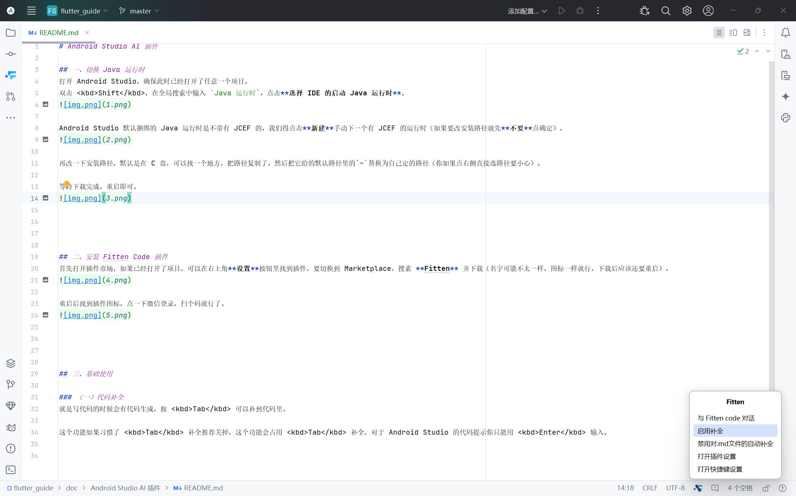

# Android Studio AI 插件

> 更改 JCEF Java 运行时也可以让 Android Studio 支持渲染 Markdown 文件（`.md`）。
> 
> 如果你因更改 Java 运行时失误导致 Android Studio 无法正常启动，请根据提示设置 JAVA_HOME 环境变量后重启，并重新将 Java 运行时设定为默认值。

## 目录

- [一、切换 Java 运行时](#一切换-java-运行时)
- [二、安装 Fitten Code 插件](#二安装-fitten-code-插件)
- [三、基础使用](#三基础使用)
    - [（一）代码补全](#一代码补全)
    - [（二）带代码聊天](#二带代码聊天)

## 一、切换 Java 运行时

打开 Android Studio，确保此时已经打开了任意一个项目。
双击 <kbd>Shift</kbd>，在全局搜索中输入 `Java 运行时`，点击**选择 IDE 的启动 Java 运行时**。

Android Studio 默认捆绑的 Java 运行时是不带有 JCEF 的，我们得点击**新建**手动下一个有 JCEF 的运行时。

再改一下安装路径，默认是在 C 盘，可以找一个地方，把路径复制了，然后把它给的默认路径里的`~`替换为自己定的路径（建议不要直接点右侧的选取文件夹按钮）。

等待下载完成，重启即可。

## 二、安装 Fitten Code 插件

首先打开插件市场，如果已经打开了项目，可以在右上角**设置**按钮里找到插件，要切换到 Marketplace，搜素 **Fitten** 并下载（名字可能不太一样，图标一样就行，下载后应该还要重启）。

重启后找到插件图标，点一下微信登录，扫个码就行了。

## 三、基础使用

### （一）代码补全

就是写代码的时候会有代码生成，按 <kbd>Tab</kbd> 可以补到代码里，这个默认是开启的，在右下角图标可以设置。

这个功能如果习惯了 <kbd>Tab</kbd> 补全推荐关掉，这个功能会占用 <kbd>Tab</kbd> 补全，对于 Android
Studio 的代码提示你只能用 <kbd>Enter</kbd> 输入。

### （二）带代码聊天

基础的聊天功能就不说了，如果是代码文件里有部分代码存在问题，可以选中这部分代码，此时聊天框上方会提示**引用信息**，发消息时会连带着这部分代码一起发送，就不用自己手动复制粘贴了。

