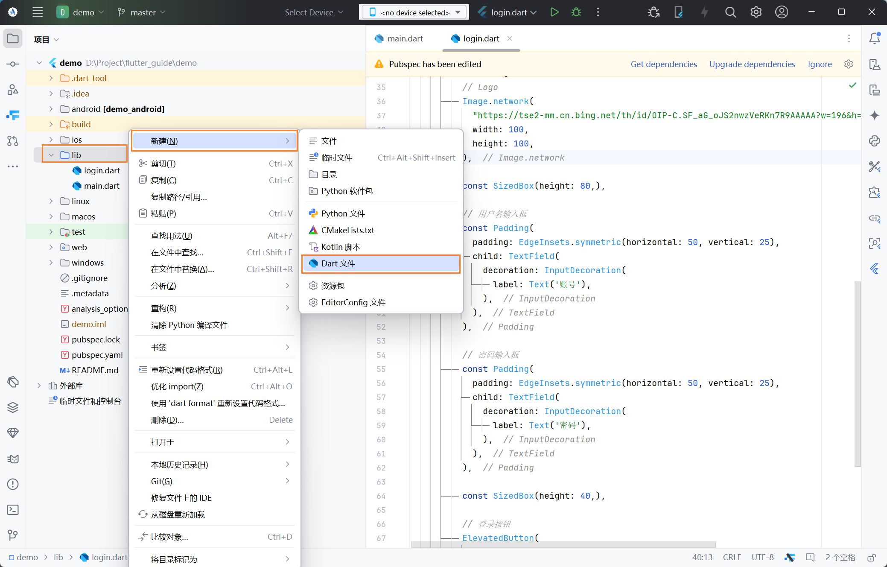
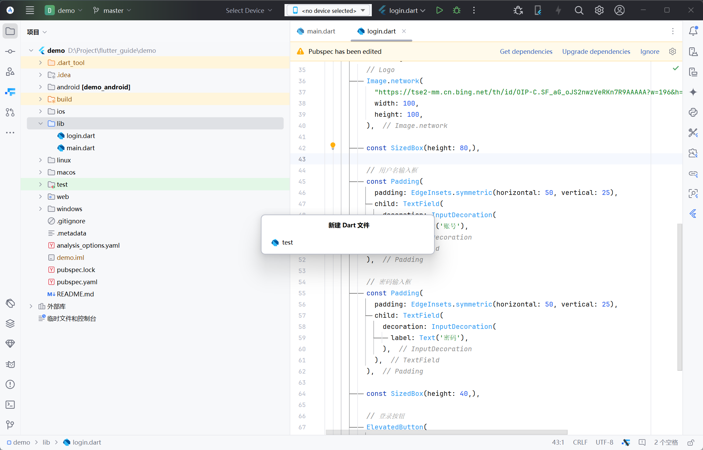
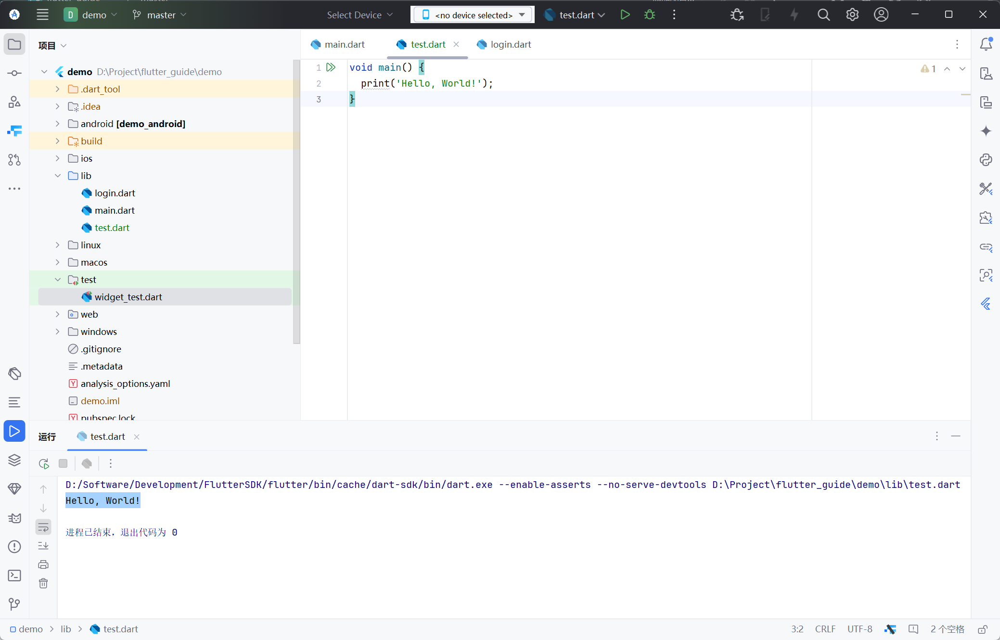

# Dart 快速入门

> 本文档只列举一些常用的语法，如果其他有需要，可以参考 [Dart 文档](https://dart.cn/guides/)或询问 AI。

在开始之前，请像我一样在 [lib](../../demo/lib) 下新建一个名为 `test` 的 .dart 文件：

1. 右键 lib 文件夹，选择**新建** > **Dart 文件**
   
2. 在中心弹出的输入框中输入`test`，按一下 <kbd>Enter</kbd>（键盘上），你会得到一个空白的 .dart 文件，让我们开始接下来的内容吧。
   

## 目录

- [一、运行入口](#一运行入口)
- [二、注释](#二注释)
- [三、变量](#三变量)
    - [（一）定义变量](#一定义变量)
    - [（二）关键字](#二关键字)
    - [（三）可空类型](#三可空类型)
- [四、流程控制语句](#四流程控制语句)
    - [（一）条件语句](#一条件语句)
    - [（二）循环语句](#二循环语句)
- [五、函数](#五函数)
    - [（一）函数定义](#一函数定义)
    - [（二）函数作为参数](#二函数作为参数)
    - [（三）可选参数](#三可选参数)
    - [（四）命名参数](#四命名参数)
- [六、类](#六类)
    - [（一）定义、实例化类](#一定义实例化类)
    - [（二）构造函数](#二构造函数)
    - [（三）私有成员](#三私有成员)
    - [（四）继承](#四继承)

## 一、运行入口

在 .dart 文件中，你必须具备一个 `main` 函数，才能运行该文件。

当给出 `main` 后，Android Studio 会在该函数左侧显示运行按钮，点击此按钮，选择运行即可运行该函数中的内容。

```dart
void main() {
  print('Hello, World!');
}
```



## 二、注释

Android Studio 中，注释的快捷键是 <kbd>Ctrl</kbd> + <kbd>/</kbd>。
该快捷键可以让你为光标所在的一行注释或去掉注释（只对 `//` 有效）。

在 Dart 中，注释可以使用 `//`（单行）、`///`（文档注释，多用于类和方法前）和`/**/`（多行注释，不常用也不推荐用）。
注释主要是为了解释说明代码作用，不会影响代码的运行。

```dart
/// 这是运行入口
void main() {
  // 在控制台输出 Hello, World!
  print('Hello, World!');

  /*
  这是多行注释
  在这里面的注释可以跨多行
   */
}
```

## 三、变量

### （一）定义变量

在 Dart 中，定义变量的格式如下：

```
关键字 类型 变量名 = 变量值;
```

可能不是很清晰，可以看一下例子：

```dart
void main() {
  // 类型 变量名
  // var 和类型只能二选一，var int number 是错误的
  int number;

  // 类型 变量名 = 变量值
  double decimal = 0.1;

  // 关键字 变量名 = 变量值
  final dart = "Dart";

  // 关键字 类型 变量名 = 变量值
  final String flutter = "Flutter";
}
```

Dart 是支持自动类型推断的，在多数情况下定义变量不需要指明其类型。
你可能是第一次听，让我们来看看怎么回事：

```dart
void main() {
  // 正常情况下
  // 定义一个变量是需要指定该变量的类型
  int number0 = 0;

  // 你也可以这样做
  // 如果你把鼠标悬停在 number1 上
  // 会发现它的类型是 int
  // 可是我们并没有声明它的类型，只是给它赋了值
  // Dart 通过这个值推断出了 number1 为 int
  var number1 = 1;

  // 如果既没有声明类型，也没有赋值
  // 此时类型为 dynamic（动态的）
  // 相当于 dynamic any
  // any 可以赋值为任意类型
  var any;
}
```

### （二）关键字

在定义变量时，可以使用 `var`、`final`、`const` 来修饰。

| 关键字     | 说明                     |
|---------|------------------------|
| `var`   | 修饰的变量值可以被改变            |
| `final` | 修饰的变量值不可变              |
| `const` | 修饰的变量值不可变，且类成员中不能有可变变量 |

> **笔记**
>
> 如果你不能理解“类成员”，请先忽略它，这**不是**一个很重要的点，你只需要知道 `const` 比 `final` 要求更加苛刻。

### （三）可空类型

空指的是 `null`，通常情况下，一个变量没有被声明为可空，它将**不能**被赋值为 `null`。

你可以在类型后加上 `?` 将变量声明为可空的：

```dart
void main() {
  int? nullableNumber = 1;
  nullableNumber = null; // 这是可行的


  int number = 1;
  // number = null;  // 这是错误的
}
```

## 四、流程控制语句

在 Dart 中，这一部分还有一些其他的语法，你可以参考[分支](https://dart.cn/language/branches/)和[循环](https://dart.cn/language/loops/)，这里不过多展开。

### （一）条件语句

你可以使用 `if`、`if...else if`、`if...else if...else`（`else if` 可以有多个）来设定符合某一条件时，程序执行什么操作。

```dart
void main() {
  final list = [1, 2, 3]; // 类型为 List<int>（如果你看不懂尖括号，可以去了解一下 Dart 泛型）

  if (list.length == 3) {
    // 列表有 3 个元素
    print("list 长度为 3");
  } else if (list.isEmpty) {
    // 列表为空，这里的空，是指列表里没有元素，而不是 null
    print("list 为空");
  } else {
    // 除去以上条件的其他情况
    // 也就是列表有元素且元素个数不为 3
    print("list 长度不为 3，且非空");
  }

  if (list.isNotEmpty && list[0] == 1) {
    // 不为空且第一个元素为 1
    print("list 中第一个元素为 1");
  }
}
```

### （二）循环语句

```dart
void main() {
  // while 循环
  int count = 0;
  while (true) {
    if (count == 10) {
      break;
    }

    // 使用加号拼接字符串，count 需要转为字符串才能使用
    print("count = " + count.toString());

    count++;
  }

  // for 循环
  for (int i = 0; i < 10; i++) {
    // 使用 $ 将变量嵌入一段字符串中
    // 此时会自动调用变量的 toString 方法转为字符串
    print("i = $i");
    // 如果嵌入的是函数或包含“.”运算符，则必须使用 {} 括起来
    // print("i = ${i.toString()}");
  }
}
```

## 五、函数

### （一）函数定义

定义函数的格式如下：

```
返回值类型 函数名(参数类型 参数名, ...) [=> 表达式 | {函数体}]
```

还是看一下例子：

```dart
/// 返回值只有一个表达式时
/// 可以使用箭头
int add(int a, int b) => a + b;

/// 也可以使用常规的 return
int sub(int a, int b) {
  return a - b;
}

/// 当返回值类型为 void，即无返回值时，void 可省略
/// 勘误：任何时候都可以省略返回值类型，此时返回值类型为 dynamic 即返回值可以是任何类型
main() {
  int result = add(1, 1);
  print(result); // 2

  print(sub(2, 1)); // 1

  // 这里无返回值，省略 return
  return;
}
```

### （二）函数作为参数

```dart
/// 将 [action] 作为函数参数传入 [call] 中
/// 让 [call] 为我们决定什么时候执行该函数
void call(Function action) {
  // 因为是例子，这里就直接调用了
  action();
}

main() {
  // 这里我们需要使用 “() {}” 传入一个匿名函数
  // 在 {} 里可以写多个语句
  call(() {
    print("匿名函数");
  });

  // 或者使用 “() => {}” 传入一个箭头函数
  // 在 {} 里只能写一个表达式
  // 注意，这里 print 后面不能加分号
  call(() => { print("箭头函数") });

  // 也可以省略 {}
  call(() => print("单表达式"));

  final list = [1, 2, 3, 4];
  // forEach 接收一个参数类型为 Function(int) 的函数
  // 参数名 item 可以随意取，其类型与 Function(int) 有关
  // （啰嗦两句）如果有一个参数类型为 Function(String, double)
  // 在传参时 (param1, param2) {}，param1 为 String，param2 为 double
  // 即使调换为 (param2, param2) {}，在第一位的 param2 一定是 String
  list.forEach((item) => print(item));
}
```

### （三）可选参数

在函数参数中，可以使用 `[]`，在其中声明带默认值的可选参数（第一次用多少感觉有点反人类），如果可选参数是可空类型，则可以不设置默认值，此时默认为 `null`。

```dart
/// 假定有一个 read 函数用于读取文件
/// 此函数有一个必填参数 filename
/// 同时有一个可选参数 encoding，默认为 utf-8
String read(String filename, [String encoding = "utf-8"]) =>
    "使用 $encoding 读取的 $filename 文件内容";

main() {
  // 此时没有指定，encoding 为默认值 utf-8
  print(read("file.txt")); // 使用 utf-8 读取的 file.txt 文件内容

  // 指定以 gbk 编码读取
  print(read("file.txt", "gbk")); // 使用 gbk 读取的 file.txt 文件内容
}
```

### （四）命名参数

在函数参数中，可以使用 `{}`，在其中声明命名参数。

```dart
/// 还是那个 read
/// 将 [] 改为 {}
String read(String filename, {String encoding = "utf-8"}) =>
    "使用 $encoding 读取的 $filename 文件内容";

main() {
  // 此时没有指定，encoding 为默认值 utf-8
  print(read("file.txt"));

  // 若需给 encoding 赋值，必须指定参数名
  print(read("file.txt", encoding: "gbk"));
}
```

如果我要限定 `filename` 也必须在调用时指定参数名，但不希望给它默认值，则可以将其移入 `{}`中，并使用 `required` 修饰，此时该参数在调用时必须指定参数名、必须赋值。

```dart
String read({required String filename, String encoding = "utf-8"}) =>
    "使用 $encoding 读取的 $filename 文件内容";

main() {
  print(read(filename: "file.txt"));

  print(read(filename: "file.txt", encoding: "gbk"));
}
```

## 六、类

### （一）定义、实例化类

```dart
class App {
  // name 为 App 的一个成员变量
  // 每一个 App 的实例化对象都有一个独立的 name
  // 更改一个 App 对象的 name 并不会影响其他对象的 name
  final name = "myApp";
}

main() {
  // 这里像调用函数一样，实例化一个类
  // 在 Android Studio 中，App() 被标记为蓝色
  // 而 调用函数时并没有此标记
  App app = App();

  print(app.name); // myApp
}
```

### （二）构造函数

如果我们希望 `App.name` 在实例化时才赋值，可以定义一个构造函数：

```dart
class App {
  String name;

  // 使用 this.name 可以将成员变量 name 作为构造函数的参数
  // 因为自动类型推断的存在，此时可以省略 name 的类型
  App(this.name);
}

main() {
  // 此时无参数的 App() 就用不了了
  App app = App("Flutter");

  print(app.name); // Flutter
}
```

回扣一下之前提到的 `const` 关键字，我们提到如果用 `const` 修饰，那么类成员中不能有可变变量，你如果尝试将 `final` 去掉，将会收到错误提示。

```dart
class App {
  // 必须指明为 final
  final String name;

  const App(this.name);
}

main() {
  // const 可以写在 App() 前
  App app = const App("Flutter");
  // 或者这样写
  const App app1 = App("Flutter");
}
```

当构造函数的函数名与类名相同时，此构造函数会被定为默认构造函数，有且只能有一个。
有时候我们还希望能在默认构造的基础上加点其他的参数，此时可以使用 `类名.构造函数名` 的方式定义一个新的构造函数。
此时构造函数名可以随意取，在调用时，需以 `类名.构造函数名()` 的形式调用。

```dart
class App {
  String name;
  var version = "1.0.0";

  App(this.name);

  App.withVersion(this.name, this.version);
}

main() {
  App flutterV1 = App("Flutter");

  print("${flutterV1.name} ${flutterV1.version}"); // Flutter 1.0.0

  App flutterV2 = App.withVersion("Flutter", "2.0.0");

  print("${flutterV2.name} ${flutterV2.version}"); // Flutter 2.0.0
}
```

### （三）私有成员

在 Dart 中，使用 `_` 开头的变量或函数名可以阻止外部库访问，不在同一目录下就不在同一库中（在此前我用了一种错误的说法说明 `_` 的作用，如有误导十分抱歉）。
当然，在库内还是可以自由访问的。

```dart
// 这个在 lib 中
class App {
  final _devCode = 125;
}

main() {
  final app = App();

  print(app._devCode); // 125
}
```

```dart
import '../test.dart';

// 这个在 lib/other 中
main() {
  final app = App();

  // print(app._devCode);  // 这是错误的
}
```

### （四）继承

使用 `extends` 关键字声明某一个类继承自其他类。
此时，你可以说，`App` 就是 `StatelessWidget`，反之**不成立**。
`App` 为 `StatelessWidget` 的子类，而 `StatelessWidget` 为 `App` 的父类。

```dart
import 'package:flutter/cupertino.dart';

class App extends StatelessWidget {
  @override
  Widget build(BuildContext context) {
    // TODO: implement build
    throw UnimplementedError();
  }
}

main() {
  runApp(App());
}
```

如果子类中需要调用父类的成员变量或方法，需要使用 `super`：

```dart
import 'package:flutter/cupertino.dart';

class App extends StatelessWidget {
  // 这里是结合之前函数那一块的可选命名参数
  // 并且以父类的 key 作为可选参数中的一员
  // 在调用时，可以直接 App()
  // 也可以给 key 指定值 App(key: Key("MyKey"),)
  const App({super.key});

  // ... 重写 build 部分省略
}
```