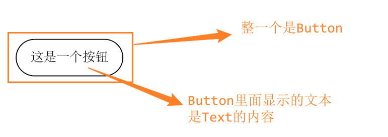
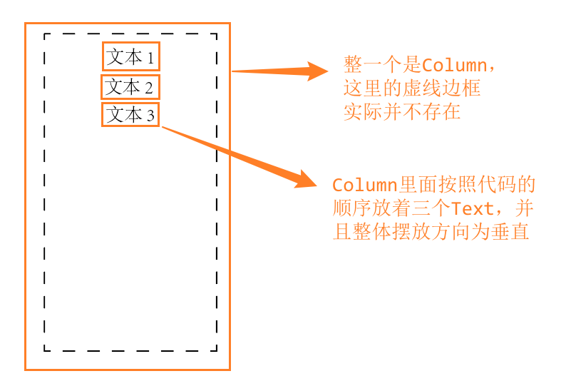
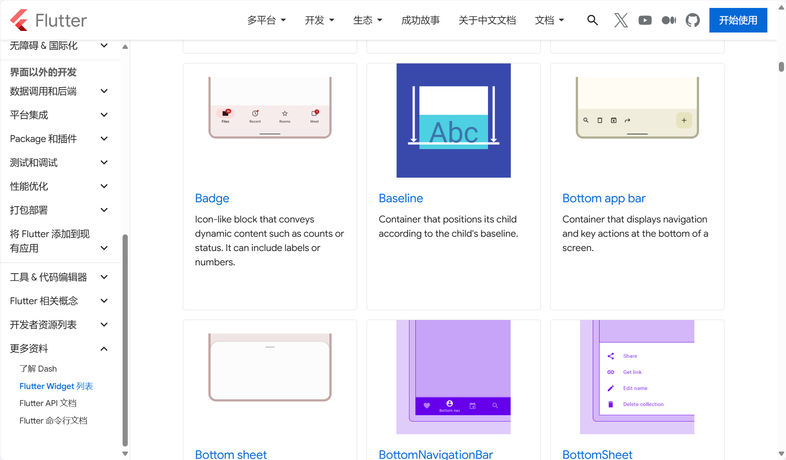
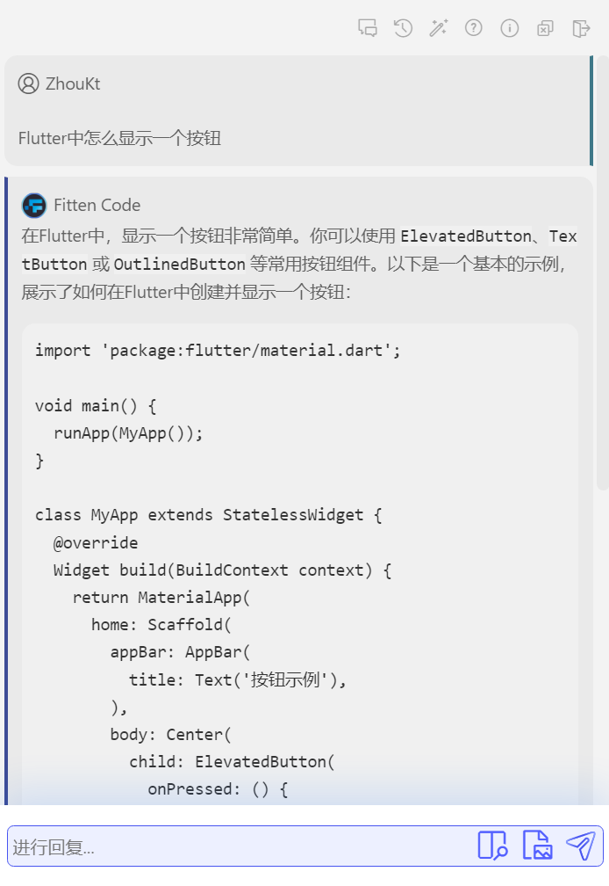
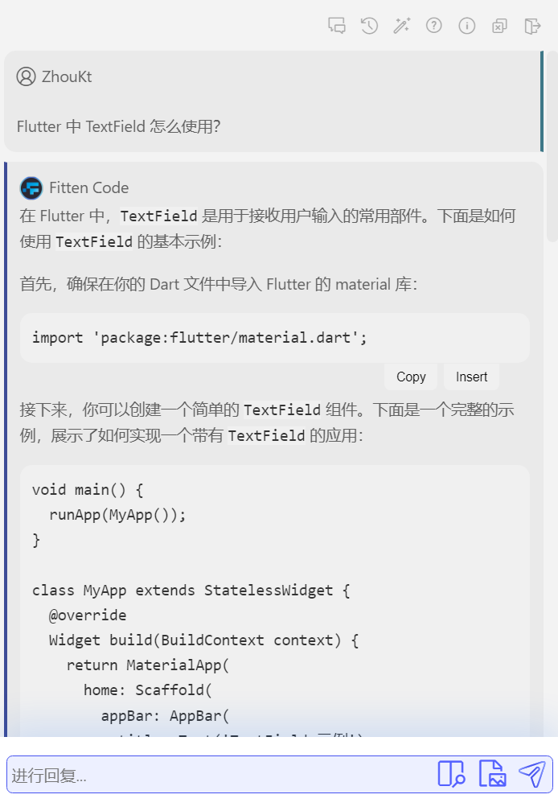

# Flutter 项目简介

## 目录

- [一、简介](#一简介)
- [二、项目结构简化](#二项目结构简化)
- [三、理解 Flutter UI](#三理解-flutter-ui)
- [四、使用 Flutter 组件](#四使用-flutter-组件)

## 一、简介

Flutter （/ˈflʌtər/） 是基于 Dart（/dɑrt/） 语言设计的一个跨平台 UI（User Interface，用户界面） 框架。

基于 Flutter 构建的 UI 可以运行于 Windows、Linux、MacOS、Android、iOS、Web，此所谓跨平台。

Flutter 项目本质上是 Dart 项目。

## 二、项目结构（简化）

下方是一个勾选了全平台的 Flutter 项目 [demo](../../demo) 根目录下的重要文件（夹）说明，其他未涉及到的可以自行查询了解。

```
demo
├── android         平台代码: Android
├── ios             平台代码: iOS
├── lib             Dart 代码，这也是平时写代码的地方
├── linux           平台代码: Linux
├── macos           平台代码: macOS
├── test            测试代码（少用甚至不用）
├── web             平台代码: Web
├── windows         平台代码: Windows
└── pubspec.yaml    项目配置
```

## 三、理解 Flutter UI

> **备注**
>
> 在这一部分我会用一些简单的、无法运行的伪代码用于说明。

Flutter 中内置了很多组件（`Widget`），像是按钮、输入框、图片......这些都有特定的组件。
几个组件可以组成一个更大的组件，甚至我们可以说，整一个页面也是一个组件。

在 Flutter 中的组件都是类，如果要让某一个组件显示在屏幕中，只需要实例化该类即可。
Flutter 已经为我们设计了这些组件该怎么去绘制、显示，我们只需要把它们拿出来，放到界面上就行了。

```
Text("Hello Flutter"); -> 界面中会显示一段内容为“Hello Flutter”的文本
```

> **笔记**
>
> 在 Dart 中，实例化类的对象不需要使用 `new` 关键字，这使得实例化在多数时候看起来像是调用函数。

有些组件具备一个小口袋可以装一个组件，这个口袋一般是一个名为 `child` 的参数。像是按钮就有一个 `child` 可以用来装一个组件，如果你放一个 `Text`，它就会变成按钮里的文字。

```
Button(child: Text("这是一个按钮"));
```



也有的组件口袋比较大可以装多个组件，这个口袋叫 `children`。像是比较常用的用于布局的组件 `Column`，它里边可以装多个元素，并且让所有元素垂直排列。

```
Column(
    children: [
        Text("文本 1"),
        Text("文本 2"),
        Text("文本 3"),
    ],
);
```



## 四、使用 Flutter 组件

Flutter 中包含的组件很多，而且一个组件又会有很多的属性供我们设置，如果每个组件都去仔细学习一遍显然是不现实的。

这里先推荐一下 Flutter [组件库文档](https://docs.flutter.cn/reference/widgets)（点击这里蓝字跳转，以后就不提示了。
有蓝字一般就是链接，而且这里的文档不会像其他平台能被插入广告，可以放心），这里面列举了 Flutter 中的组件，并且还有配图。



常用的组件多用几次就记住了，而不常用的组件我们也可以使用 AI 帮助我们快速学习使用。
如果你想在 Android Studio 中有一个实用的 AI 插件，请前往学习 [Android Studio AI 插件](../Android%20Studio%20AI%20插件/README.md)。

如果你不知道要使用什么组件实现某一个功能，可以这样问：



如果你想用某个组件，可以这样问：


