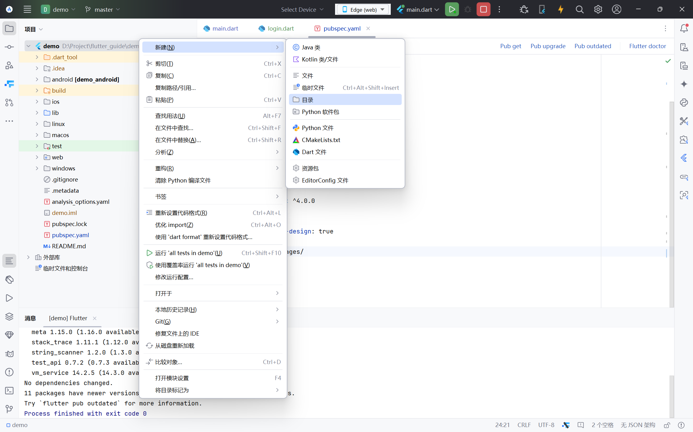
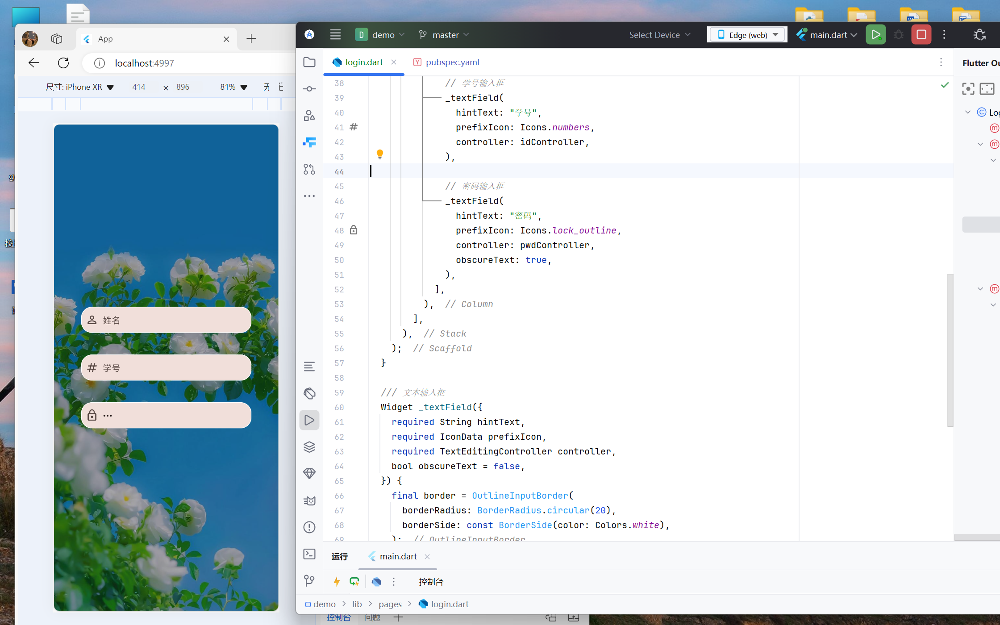

# 带背景登录页

> [login.dart](../../demo/lib/pages/login.dart)&nbsp;&nbsp;
> [main.dart](../../demo/lib/main.dart)
> 
> 最后编辑时间：2024.10.15 10:51
> 
> 

## 目录
- [一、文件架构](#一文件架构)
- [二、main.dart 文件简化](#二maindart-文件简化)
   - [了解 main.dart 的默认代码](#一了解-maindart-的默认代码)
   - [编写自己的 main.dart](#二编写自己的-maindart)
- [三、登录页](#三登录页)
   - [（一）读题做草图](#一读题做草图)
   - [（二）创建登录页](#二创建登录页)
   - [（三）设置背景图片](#三设置背景图片)
     - [1. 配置资源](#1-配置资源)
     - [2. 使用 Stack 实现背景图](#2-使用-stack-实现背景图)
   - [（四）添加输入框](#四添加输入框)
   - [（五）添加登录按钮](#五添加登录按钮)


## 一、文件架构

感觉在开始之前还是很有必要讲一下这一点的。

平常写 Dart 代码都是在 [lib](../../demo/lib) 下，但是如果代码文件多了，你会发现自己的 lib 会变得非常乱。
有效的做法是将这些文件都整理一下放到 lib 中的不同文件夹里，为了避免这种亡羊补牢的情况，我们提前掌握一下这个内容。

下方是一个简单的架构：`pages` 只是一个文件夹，你叫它阿猫、阿狗都行，但是一定要足够清晰。
总之我们这里是存放这个 App 所用页面的地方。

```
libs
├── pages           这里存放 App 的多个页面
└── main.dart       这是整一个项目的入口
```

你可以右键 lib 文件夹，选择新建一个目录，并输入 `pages` 按一下 <kbd>Enter</kbd> 即可。


## 二、main.dart 文件简化

### （一）了解 main.dart 的默认代码

默认情况下，[main.dart](../../demo/lib/main.dart) 中会有一些默认代码，详细解读你可以参考下方代码块。

稍微提一下整体思路，这里 `main` 函数调用了 `runApp`，它需要传入一个类型为 `Widget` 的参数，在运行时会渲染传入的 `Widget`。

在 Flutter 中，我们不直接使用 `Widget`，而是使用其子类 `StatelessWidget`（无状态） 和 `StatefulWidget`
（有状态，需要搭配 `State`），它们都是抽象类，需要我们用其他类继承该类并重写它们的抽象方法。

这里的 `MyApp` 其实也是一个组件，在它的 `build` 方法中返回了 `MaterialApp`，才让它出现 App 的形态。

```dart
// 导入这个库，里边有我们要用到的一些组件
import 'package:flutter/material.dart';

// void main 是程序入口点，运行 main.dart 会运行 main 函数里的内容
void main() {
  // 调用 runApp 运行 Flutter App
  // 传入的参数为 MyApp 对象（实质是 StatelessWidget）
  // 在 Dart 中创建类对象不需要使用 new 关键字
  // 使用 const 修饰符标记该对象不可变（性能优化），很多时候可以根据 Android Studio 的提示加上或去掉
  runApp(const MyApp());
}

// 定义 MyApp 继承自 StatelessWidget（无状态组件）
class MyApp extends StatelessWidget {
  // 这是声明 MyApp 的构造函数，在 {} 中可以定义命名参数，在调用时必须指定参数名
  // 这里是以父类（super）的 key 作为参数。在父类中已经声明了类型，Dart 可以推断类型，因此类型声明可以省略
  const MyApp({super.key});

  // @override 表示重写
  // 这里需要重写父类的抽象方法 build 返回 Widget 对象构造页面内容
  @override
  Widget build(BuildContext context) {
    // MaterialApp 可以为我们提供 Material Design 的支持
    // 它继承自 StatefulWidget
    // 注：StatefulWidget 和 StatelessWidget 都继承自 Widget，因此它们都是 Widget
    return MaterialApp(
      // 设置该 App 在 Android 任务管理器显示的描述，在 iOS 中该值无效
      title: 'Flutter Demo',
      // 设置主题
      theme: ThemeData(
        // 配色方案，可以通过 ColorScheme.fromSeed 将一个颜色作为种子生成配色方案
        colorScheme: ColorScheme.fromSeed(seedColor: Colors.deepPurple),
        // 是否使用 Material Design 3
        // 我的 Flutter 版本是 3.24.1，此时 useMaterial3 的默认值为 true
        useMaterial3: true,
      ),
      // 设置首页
      home: const MyHomePage(title: 'Flutter Demo Home Page'),
    );
  }
}

// 定义 MyHomePage 继承自 StatefulWidget（有状态组件，就是其中有一些会跟随着用户操作而改变的组件状态值）
class MyHomePage extends StatefulWidget {
  // 这里还是一个构造函数
  // 这里 title 加了 required 表示该参数在调用时必须传入
  const MyHomePage({super.key, required this.title});

  // 这里定义了一个 String 类型的成员变量
  final String title;

  // 重写 StatefulWidget 的 createState 方法
  // 这里使用 => 来表示该函数返回 _MyHomePageState()
  // => 在函数的返回值为一个表达式时可以使用，让代码更简洁
  // 例：int getLength() => 2;
  @override
  State<MyHomePage> createState() => _MyHomePageState();
}

// 定义 MyHomePage 的状态，继承自 State<T>，T 继承自 StatefulWidget，表明该状态所属的组件
// 此处 MyHomePageState 前加了 _，表示该类在文件外部不可见
class _MyHomePageState extends State<MyHomePage> {
  // 这里也是不可见，但是是在类之外不可见
  int _counter = 0;

  // 此方法用于让 _counter 加 1，该方法也类外不可见
  void _incrementCounter() {
    // 调用 setState让组件状态改变，如果直接让 _counter + 1 界面上不会更新 _counter 的值
    // 传入的参数是一个返回值为 void（无返回值）的函数
    setState(() {
      _counter++;
    });
  }

  // 和 StatelessWidget 类似，我们重写 State 的 build 方法，返回 Widget 对象
  @override
  Widget build(BuildContext context) {
    // Scaffold 是比较常用的用于构建页面的脚手架
    // 它提供了插槽用于放置页面内容、顶部导航栏和底部导航
    return Scaffold(
      // 顶部导航栏
      appBar: AppBar(
        // 顶部导航背景色
        // 使用 Theme.of(context).colorScheme 可以获取到我们当前的配色方案，配色方案中有颜色值可以选
        backgroundColor: Theme
            .of(context)
            .colorScheme
            .inversePrimary,
        // 顶部导航文本，Text 也是一个 Widget，传入 String 类型参数可以显示文本
        title: Text(widget.title),
      ),
      // 页面内容
      // 使用 Center 可以让内容居中
      body: Center(
        // 给 child 传入放在 Center 中的内容
        // 使用 Column 可以让内容垂直摆放
        child: Column(
          // 调整子项在主轴（内容摆放的方向，此时为垂直方向）上居中
          mainAxisAlignment: MainAxisAlignment.center,
          // Column 的子项，Column 中可以有多个子项
          // 因此参数名为 children，传入的是 Widget 数组
          children: <Widget>[
            const Text(
              'You have pushed the button this many times:',
            ),
            Text(
              '$_counter',
              style: Theme
                  .of(context)
                  .textTheme
                  .headlineMedium,
            ),
          ],
        ),
      ),
      // 右下角悬浮按钮
      floatingActionButton: FloatingActionButton(
        // 按钮点击事件
        onPressed: _incrementCounter,
        // 长按该按钮的提示信息（在浏览器为鼠标悬停时）
        tooltip: 'Increment',
        // 按钮中的内容，此处为一个加号图标
        child: const Icon(Icons.add),
      ), // （翻译）尾部加个逗号会让自动同步（Ctrl + Alt + L）更好看
    );
  }
}
```

### （二）编写自己的 main.dart

这里先把 `main.dart` 里的内容**全选删掉**。

首先需要定义一个 `App` 类继承自 `StatelessWidget`，然后把光标放在 `App` 上，按下快捷键 <kbd>
Alt</kbd> + <kbd>Enter</kbd> 修复该错误，选择第一项（这里可以直接按一下 <kbd>Enter</kbd>，期间会选到
`BuildContext` 和 `context` 上，都按一下 <kbd>Enter</kbd> 就行了）。


> **笔记**
>
> 最前面的 `import ...` 并不需要自己输入，在你输入 `StatelessWidget`
> 的过程中它会提示你该类，你只需要按下 <kbd>Tab</kbd> 或 <kbd>Enter</kbd> 同意它的提示即可自动导入。

修复后会变成下边这样，这时候你会发现 `App` 下方有浅色下划曲线，再次将光标放在 `App` 上，重复 <kbd>
Alt</kbd> + <kbd>Enter</kbd> 快速修复。

```dart
import 'package:flutter/cupertino.dart';

class App extends StatelessWidget {
  @override
  Widget build(BuildContext context) {
    // TODO: implement build
    throw UnimplementedError();
  }
}
```

然后把 `build` 方法里的 TODO 删掉，就变成这样了（注释的部分只是为了标注更改的地方，请忽略）：

```dart
import 'package:flutter/cupertino.dart';

class App extends StatelessWidget {
  const App({super.key});  // 这一行是修复时自动生成的

  @override
  Widget build(BuildContext context) {
    // 把这两行删掉
  }
}
```

在前面我们知道，要想让一个组件成为一个 App，我们得在 `build` 中返回 `MaterialApp`。
这个时候顶部的 `import 'package:flutter/cupertino.dart';`
出现了虚线，因为该导入目前已经没用了，可以按快捷键 <kbd>Ctrl</kbd> + <kbd>Alt</kbd> + <kbd>O</kbd>
快速去掉它。

```dart
import 'package:flutter/material.dart';

class App extends StatelessWidget {
  const App({super.key});

  @override
  Widget build(BuildContext context) {
    return MaterialApp();
  }
}
```

这里给 `MaterialApp` 一个 `title`，再传一下主题 `theme`，它的值为一个 `ThemeData` 对象，再改一下配色方案 `colorScheme`。

对于 `ColorScheme.fromSeed` 的 `seedColor`，你可以从 `Colors` 中选一些预设的颜色值，也可以使用 `Color(0xFFFF0000)`（参数为十六进制的 ARGB 值，开头的 `0x` 表示后边跟的是一个十六进制）或 `Color.fromARGB(255, 255, 0, 0)`（ARGB，每个值为 0~255 的整数）生成一个颜色值。

`debugShowCheckedModeBanner` 是运行时屏幕右上角的 Debug 标识，因为有点难看所以设置为 `false` 去掉。

而 `home` 的值我们可以空着备用，以后如果你想让首页显示哪个页面，就把那个页面的对象填到这里就行。
如果你觉得红红的很难受也可以先不写这个值，其实标红也挺好，给自己留个标记。

```dart
import 'package:flutter/material.dart';

class App extends StatelessWidget {
  const App({super.key});

  @override
  Widget build(BuildContext context) {
    return MaterialApp(
      title: 'App',
      theme: ThemeData(
        colorScheme: ColorScheme.fromSeed(seedColor: Colors.deepOrangeAccent),
      ),
      debugShowCheckedModeBanner: false,
      home:,
    );
  }
}
```

最后加一下运行入口 `main`，调用一下 `runApp` 把我们定义的 `App` 传进入就行了。
这里的 `main` 省略了 `void` 返回值并使用箭头函数的写法。

```dart
import 'package:flutter/material.dart';

class App extends StatelessWidget {
  const App({super.key});

  @override
  Widget build(BuildContext context) {
    return MaterialApp(
      title: 'App',
      theme: ThemeData(
        colorScheme: ColorScheme.fromSeed(seedColor: Colors.deepOrangeAccent),
      ),
      debugShowCheckedModeBanner: false,
      home:,
    );
  }
}

main() => runApp(const App());
```

## 三、登录页

### （一）读题做草图

> **题目**
>
> 做一个登录框，上面的输入框 label 分别是：姓名、学号、密码以及登录、取消按钮
>
> 要求：<br/>
> 1.登录框背景要有好看的图片<br/>
> 2.登录框需要使用 flex 进行布局

> **读题**
>
> 整体：登录页<br/>
> 内容：3个输入框（姓名、学号、密码） + 2个按钮（登录、取消） + 背景<br/>
> 其他：Flex 布局

在制作一个页面之前，你可以先到网上去找一找相关的图片做参考，这样会比较简单。

首先，我根据题目的要求简单做了份草图：


### （二）创建登录页

首先在 [lib/pages](../../demo/lib/pages) 下新建一个 [login.dart](../../demo/lib/pages/login.dart)
文件。


确定一下，我们页面中**不需要**一个一直随着用户操作而改变的成员变量，因此我们使用 `StatelessWidget` 而非 `StatefulWidget`（像初始代码，页面上会显示你点了按钮几次，这个次数是会在界面上变的成员变量，所以用 `StatefulWidget`）。
我们可以创建一个 `LoginPage` 继承自 `StatelessWidget`，照着之前 `App` 一样修复补全，最终得到如下内容：

```dart
import 'package:flutter/cupertino.dart';

class LoginPage extends StatelessWidget {
  const LoginPage({super.key});

  @override
  Widget build(BuildContext context) {
    // TODO: implement build
    throw UnimplementedError();
  }
}
```

接着我们就可以在 `build` 里构建页面了。
通常，在页面的最外层会使用 `Scaffold` 组件包裹，因为它提供了导航栏、浮动按钮的插槽（我们这里是用不到的了）。

```dart
import 'package:flutter/cupertino.dart';

class LoginPage extends StatelessWidget {
  const LoginPage({super.key});

  @override
  Widget build(BuildContext context) {
    return Scaffold();  // 嘿，在这里
  }
}
```

我们顺便把 `LoginPage` 写到 [main.dart](../../demo/lib/main.dart) 刚刚空出来的 `home` 里：

```dart
import 'package:demo/pages/login.dart';
import 'package:flutter/material.dart';

class App extends StatelessWidget {
  const App({super.key});

  @override
  Widget build(BuildContext context) {
    return MaterialApp(
      title: 'App',
      theme: ThemeData(
        colorScheme: ColorScheme.fromSeed(seedColor: Colors.deepOrangeAccent),
      ),
      debugShowCheckedModeBanner: false,
      home: const LoginPage(),  // 嗨，在这里
    );
  }
}

main() => runApp(const App());
```

### （三）设置背景图片

#### 1. 配置资源

因为使用网络链接可能会遇到跨域限制导致图片加载不出来，我们使用本地图片。

我们需要做一点配置内容。
首先右键你的项目名，新建目录，输入 `assets/images` 并按一下 <kbd>Enter</kbd>，这时候就会连着创建两个文件夹 `assets` 和 `images`。




接着从资源管理器复制一张图片粘贴到 [assets/images](../../demo/assets/images) 里（别看我啊，自己去下载，然后记得重命名一个简单的名字）。


最后，打开项目中的 [pubspec.yaml](../../demo/pubspec.yaml)（我已经将其中的注释全都去掉了），将该目录配置到 flutter 下（注意缩进）。

点一下右上角的 **Pub upgrade** 即可（如果出错，就点 **Pun get**，还有问题就检查一下自己是不是哪里写错了）。

```yaml
flutter:
  uses-material-design: true
  # 这里开始，assets/images/ 末尾一定要有 /
  assets:
    - assets/images/
```


回到 login.dart，试试加载这一张图片，并运行看看能否正常显示：

```dart
import 'package:flutter/material.dart';

class LoginPage extends StatelessWidget {
  const LoginPage({super.key});

  @override
  Widget build(BuildContext context) {
    return Scaffold(
      body: Image.asset("assets/images/background.jpg"),
    );
  }
}
```

#### 2. 使用 Stack 实现背景图

我们在 `Scaffold` 的 `body`（存放页面内容，如果没有提供导航栏，大小就是整一个页面）里放一个 `Stack`，这个组件可以让放在它里面的组件都堆叠起来。
因为我们需要在页面底部放一张背景图，上面是一些输入框、按钮。

```dart
import 'dart:ui';

import 'package:flutter/material.dart';

class LoginPage extends StatelessWidget {
  const LoginPage({super.key});

  @override
  Widget build(BuildContext context) {
    // 屏幕尺寸
    final size = MediaQuery.of(context).size;

    return Scaffold(
      // Stack 里的内容会按顺序重叠
      // 这里的按顺序分层，其实就类似于你拿一些纸张放到桌子上
      // 最先放上去的，就在最下层
      body: Stack(
        children: [
          // 图片位于最底层
          Image.asset(
            "assets/images/background.jpg",
            width: size.width, // 图片宽度为屏幕宽度
            height: size.height, // 图片高度为屏幕高度
            fit: BoxFit.cover, // 图片保持宽高比并裁切铺满组件大小
          ),

          // 中间层用 Container 做一下黑色透明层
          // 让背景图不至于过多吸引用户注意或影响页面内容
          // 这里调用 withOpacity 可以传入 0 ~ 1 的 double 类型数值（小数）用于调节透明度
          // 0：完全透明  1：不透明
          // 你可以根据你的图片调一个合适的值
          Container(color: Colors.black.withOpacity(0.3)),

          // 最上层放一个 Column 留着等会装输入框、按钮等组件
          // Column 是继承自 Flex 的，因此它是 Flex 布局
          Column(),
        ],
      ),
    );
  }
}

```

> **笔记**
> 
> 实现背景图片的方式多种多样，你使用 `Container` 设置 `decoration` 属性也能添加背景。
但是，我们这里要加三层：背景图 + 透明层 + 内容，如果使用 `Container`，里面还需要再套一层 `Stack` 用来透明层 + 内容，倒不如直接用 `Stack`。
> ```
> Stack（两层缩进）
> ├── 图片
> ├── 透明层
> └── 内容
> 
> Container（三层缩进）
> ├── 图片（通过 decoration 设置）
> └── Stack（通过 child 设置）
>     ├── 透明层
>     └── 内容
> ```

最后看一下效果：


### （四）添加输入框

先给 `Column` 设置 `mainAxisAlignment` 为 `MainAxisAlignment.center` 让其子组件垂直方向上居中。

接着我们要往 `Column` 的 `children` 列表里添加三个 `TextField` 作为输入框。
但是先别着急，考虑到我们需要对输入框做一些统一的设置，如果每一个都写一遍太麻烦了，我们提到一个函数 `_textField` 里：

```dart
import 'package:flutter/material.dart';

class LoginPage extends StatelessWidget {
  const LoginPage({super.key});

  @override
  Widget build(BuildContext context) {
    final size = MediaQuery.of(context).size;

    return Scaffold(
      body: Stack(
        children: [
          // 背景图
          Image.asset(
            "assets/images/background.jpg",
            width: size.width,
            height: size.height,
            fit: BoxFit.cover,
          ),

          // 透明层
          Container(color: Colors.black.withOpacity(0.3)),

          // 内容
          Column(
            // 垂直方向居中
            mainAxisAlignment: MainAxisAlignment.center,
            children: [
              // 姓名输入框
              _textField(),

              // 学号输入框
              _textField(),

              // 密码输入框
              _textField(),
            ],
          ),
        ],
      ),
    );
  }

  /// 文本输入框
  Widget _textField() {
    return TextField();
  }
}
```

看一下运行结果你会发现，三个输入框的位置非常隐蔽：


所以我们在 `_textField` 里做一下调整：
```dart
/// 文本输入框
Widget _textField({
  // 注意这里有一层 {}
  // 输入框提示文字
  required String hintText,
  // 输入框头部图标
  required IconData prefixIcon,
  // 可以通过 controller 获取输入框内容，所以这个参数是必要的
  required TextEditingController controller,
  // 输入内容是否可见
  bool obscureText = false,
}) {
  // 这个边框后边给 TextField
  final border = OutlineInputBorder(
    borderRadius: BorderRadius.circular(20),
    borderSide: const BorderSide(color: Colors.white),
  );

  // 这里外层加了一个 Padding
  return Padding(
    // 输入框调节水平、垂直边距
    padding: const EdgeInsets.symmetric(vertical: 20, horizontal: 50),

    // Padding 里面才是输入框
    child: TextField(
      obscureText: obscureText,
      // 把上面参数的 controller 给到 TextFiled 的 controller
      controller: controller,
      decoration: InputDecoration(
        hintText: hintText, // 提示文字
        prefixIcon: Icon(prefixIcon), // 头部图标
        filled: true, // 让文本框填充颜色
        
        // 调节文本框为圆角边框
        border: border,
        enabledBorder: border,
      ),
    ),
  );
}
```

> **注意**
> 
> 此处并没有按照要求给 `TextField` 添加 `label`，因为在背景图的印象下加了 `label` 并不好看，所以使用了图标来做标识。

然后在调用处传入参数：

```dart
import 'package:flutter/material.dart';

class LoginPage extends StatelessWidget {
  const LoginPage({super.key});

  @override
  Widget build(BuildContext context) {
    final size = MediaQuery.of(context).size;
    
    // 这里需要定义三个 Controller
    final nameController = TextEditingController();
    final idController = TextEditingController();
    final pwdController = TextEditingController();

    return Scaffold(
      body: Stack(
        children: [
          ...

          // 内容
          Column(
            mainAxisAlignment: MainAxisAlignment.center,
            children: [
              // 姓名输入框
              _textField(
                hintText: "姓名",
                prefixIcon: Icons.person_outline,
                controller: nameController,
              ),

              // 学号输入框
              _textField(
                hintText: "学号",
                prefixIcon: Icons.numbers,
                controller: idController,
              ),

              // 密码输入框
              _textField(
                hintText: "密码",
                prefixIcon: Icons.lock_outline,
                controller: pwdController,
                obscureText: true,
              ),
            ],
          ),
        ],
      ),
    );
  }

  /// 文本输入框
  Widget _textField({
    required String hintText,
    required IconData prefixIcon,
    required TextEditingController controller,
    bool obscureText = false,
  }) { ... }
}
```

看一下效果：



### （五）添加登录按钮

最后加两个按钮，我打算横向排列，所以外层加一个 `Row` 组件，稍微调一下边距（你不用纠结一些值要多大，你给个数看着合适就行）：

```dart
import 'package:flutter/material.dart';

class LoginPage extends StatelessWidget {
  const LoginPage({super.key});

  @override
  Widget build(BuildContext context) {
    ...

    return Scaffold(
      body: Stack(
        children: [
          ...

          // 内容
          Column(
            mainAxisAlignment: MainAxisAlignment.center,
            children: [
              _textField() x3,

              // 加一下上边距（空白）
              const SizedBox(height: 40),

              // 按钮
              Row(
                // 水平方向居中
                mainAxisAlignment: MainAxisAlignment.center,
                children: [
                  // 取消按钮
                  FilledButton(
                    // 按钮点击事件
                    onPressed: () {},
                    // 调节按钮内边距，让按钮看起来大一点
                    // 这里其实也可以将两个按钮提到函数里
                    style: FilledButton.styleFrom(
                      padding: const EdgeInsets.symmetric(
                        vertical: 16,
                        horizontal: 26,
                      ),
                    ),
                    child: const Text("取消"),
                  ),

                  // 左右加一下边距
                  const SizedBox(width: 30),

                  // 登录按钮
                  FilledButton(
                    onPressed: () {},
                    style: FilledButton.styleFrom(
                      padding: const EdgeInsets.symmetric(
                        vertical: 16,
                        horizontal: 26,
                      ),
                    ),
                    child: const Text("登录"),
                  ),
                ],
              ),
            ],
          ),
        ],
      ),
    );
  }

  /// 文本输入框
  Widget _textField(...) { ... }
}

```

