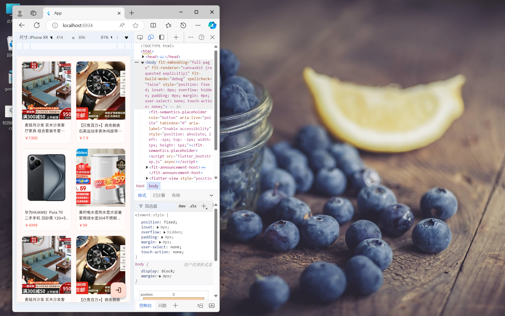
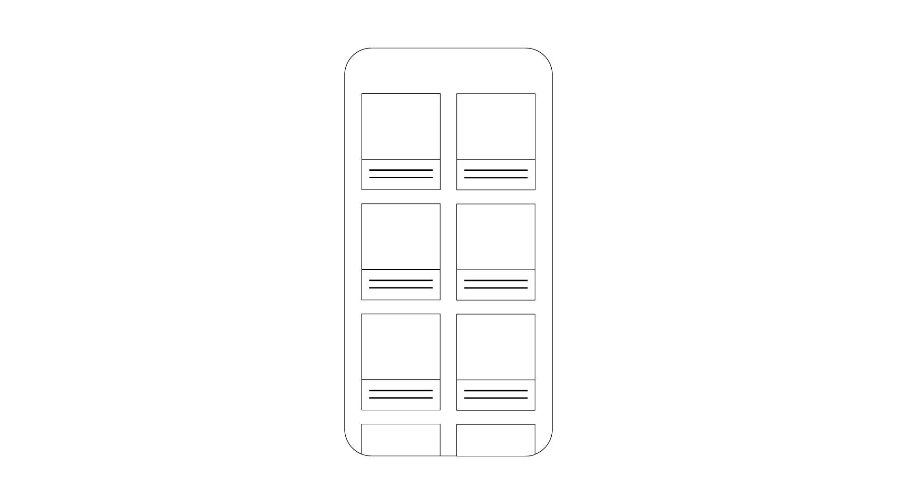
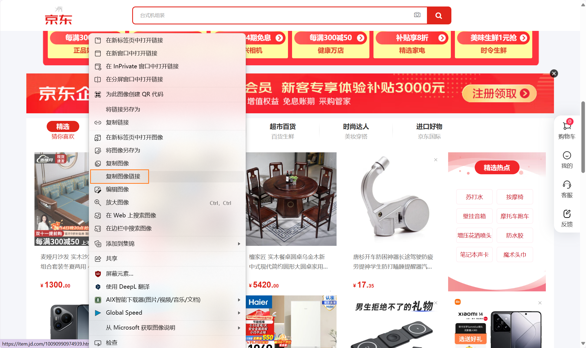
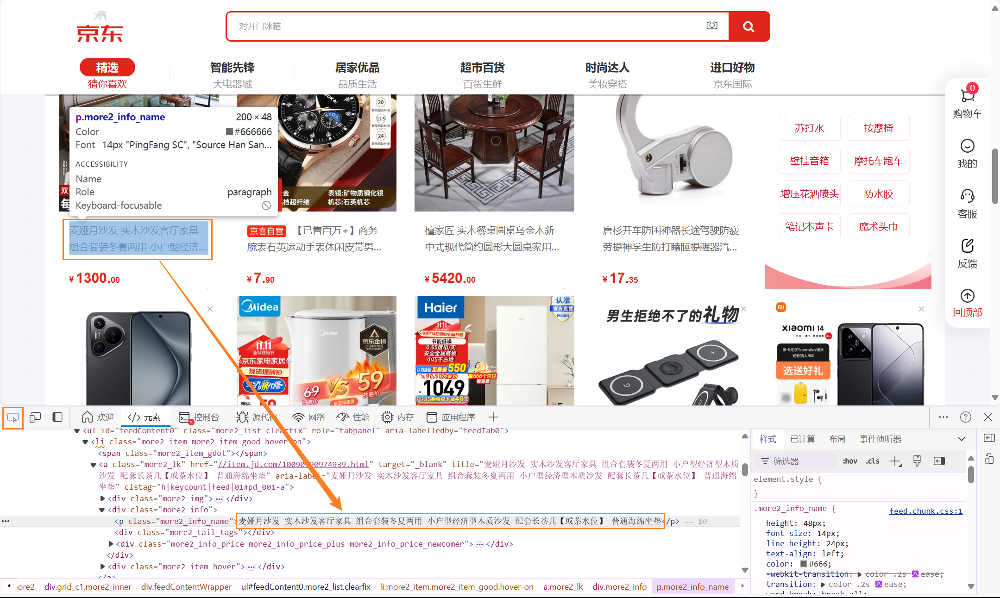
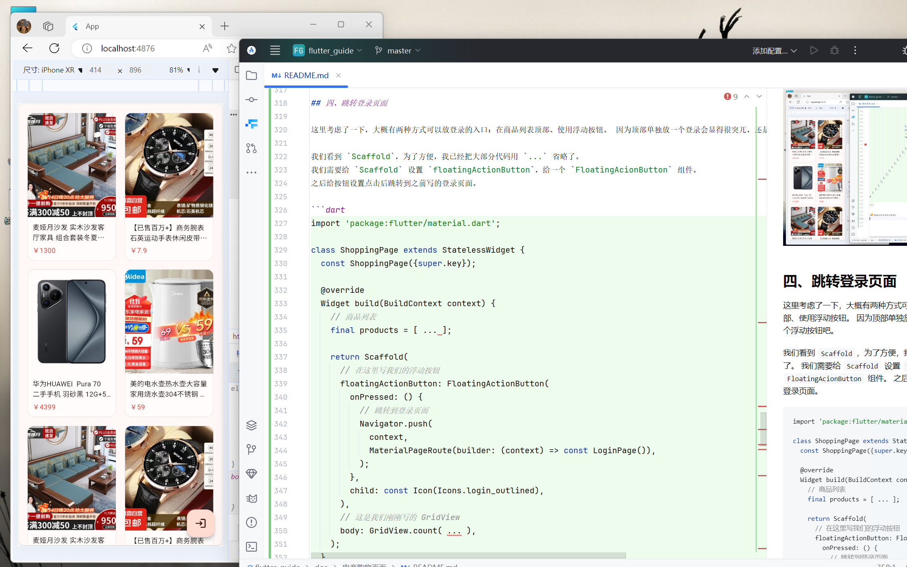
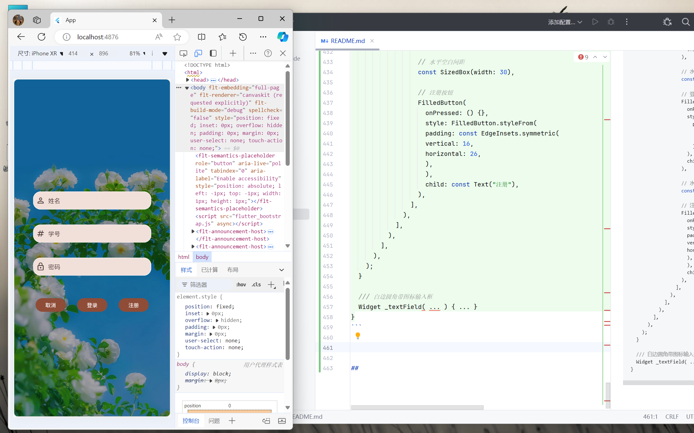
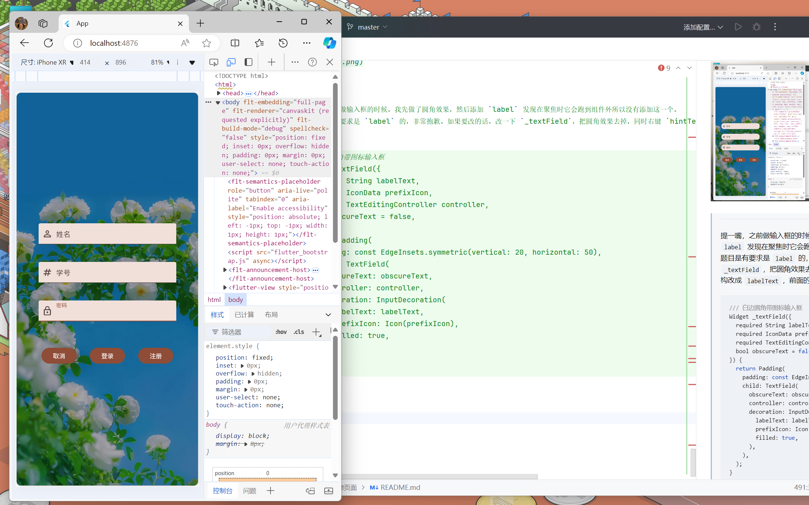

# 电商购物页面

> [shopping.dart](../../demo/lib/pages/shopping.dart)&nbsp;&nbsp;
> [login.dart](../../demo/lib/pages/login.dart)&nbsp;&nbsp;
> [pubspec.yaml](../../demo/pubspec.yaml)&nbsp;&nbsp;
> [main.dart](../../demo/lib/main.dart)
>
> 最后编辑时间：2024.10.15 11:06
>
> 

## 目录

- [一、读题做草图](#一读题做草图)
- [二、创建商品类](#二创建商品类)
- [三、添加 GridView](#三添加-gridview)
- [四、跳转登录页面](#四跳转登录页面)
- [五、给取消按钮加返回，添加注册按钮](#五给取消按钮加返回添加注册按钮)
- [六、加入注册和登录功能](#六加入注册和登录功能)


## 一、读题做草图

> **题目**
> 
> 使用 Flutter 框架中的容器组件，构建出一个电商购物页面。
> 
> 要求：
> 1. 利用之前编写的登录框进行登录，并且有注册功能，不需要使用数据库
> 2. 利用这节课提供图片排列技术进行带你上图片的排列


> **读题**
> 
> 整体：商品页<br/>
> 内容：图片列表<br/>
> 其他：连接作业 1 进行注册登录；利用课上学的图片排列技术（`GridView`）

还是稍微画一下要做的内容，你不用像我这样，只需要找一张大致的参考图就可以开始做了。
画图是为了去除一些不必要的干扰项。



## 二、创建商品类

在先前的 [lib/pages](../../demo/lib/pages) 目录中新建 [shopping.dart](../../demo/lib/pages/shopping.dart)。

关于页面的搭建就不多赘述了，目前页面中还是没有会使页面内容改变的状态，因此还是使用 `StatelessWidget`。

```dart
import 'package:flutter/material.dart';

class ShoppingPage extends StatelessWidget {
  const ShoppingPage({super.key});

  @override
  Widget build(BuildContext context) {
    return Scaffold();
  }
}
```

然后把 [main.dart](../../demo/lib/main.dart) 中的 `home` 改为 `ShoppingPage` 就行了。

```dart
import 'package:demo/pages/shopping.dart';
import 'package:flutter/material.dart';

class App extends StatelessWidget {
  const App({super.key});

  @override
  Widget build(BuildContext context) {
    return MaterialApp(
      title: 'App',
      theme: ThemeData(
        colorScheme: ColorScheme.fromSeed(seedColor: Colors.deepOrangeAccent),
      ),
      debugShowCheckedModeBanner: false,
      home: const ShoppingPage(),  // 嘿，在这里
    );
  }
}

main() => runApp(const App());
```

我们来讲点新的内容，我们的商品列表中会显示一个个商品，有商品的名称、价格和图片等等内容，我们必须先创建这个列表里的数据。

这里使用一个类来描述一件商品是比较合适的，也不容易搞错（其他的可以考虑使用 `Map`，Flutter 中的 `Map` 写起来和 Python 字典有点像）。

```dart
import 'package:flutter/material.dart';

class ShoppingPage extends StatelessWidget { ... }

/// 商品
class _Product {
  /// 标题
  final String title;
  /// 价格
  final double price;
  /// 图片 url
  final String image;

  _Product({required this.title, required this.price, required this.image});
}
```

然后就可以创建一个商品列表：

```dart
import 'package:flutter/material.dart';

class ShoppingPage extends StatelessWidget {
  const ShoppingPage({super.key});

  @override
  Widget build(BuildContext context) {
    /// 商品列表
    final _products = [
      _Product(
        title: title,
        price: price,
        image: image,
      ),
    ];

    return Scaffold();
  }
}

/// 商品
class _Product {
  /// 标题
  final String title;

  /// 价格
  final double price;

  /// 图片 url
  final String image;

  _Product({required this.title, required this.price, required this.image});
}

```

接着随便去到一个电商平台网页版，找几件商品，把它们的标题、价格、图片链接都复制并填到 `_Product` 里。

找大概 3、4 个商品就行了，因为我们可以直接让列表重复这三个商品。

对于图片，可以右键改图片，点击**复制图像链接**。



对于标题，可以先右键网页，点击**检查**打开控制台，然后打开控制台左上角的按钮。

这个时候你用鼠标点一下文字，就能在元素里定位到文字，这里的文字是完整的，先把标签展开，双击就能选中文字。

要是嫌麻烦，直接复制带 `...` 的文字也行。



对于价格，就直接写数字就行。

```dart
import 'package:flutter/material.dart';

class ShoppingPage extends StatelessWidget {
  const ShoppingPage({super.key});

  @override
  Widget build(BuildContext context) {
    // 商品列表
    final products = [
      _Product(
        title: "麦娅月沙发 实木沙发客厅家具 组合套装冬夏两用 小户型经济型木质沙发 配套长茶几【或茶水位】 普通海绵坐垫",
        price: 1300.00,
        image:
        "https://img20.360buyimg.com/jdcms/s460x460_jfs/t1/132279/10/49135/233043/670a2ff6Fb833922e/e186a4a63a1434ad.jpg.webp",
      ),
      _Product(
        title: "【已售百万+】商务腕表石英运动手表休闲皮带男士手表 黑色",
        price: 7.90,
        image:
        "https://img13.360buyimg.com/jdcms/s460x460_jfs/t1/244923/20/20140/134761/67097ba7Ffff2592e/1a61cccf69a4ffc2.jpg.webp",
      ),
      _Product(
        title: "华为HUAWEI  Pura 70  二手手机 羽砂黑 12G+512G",
        price: 4399.00,
        image:
        "https://img30.360buyimg.com/jdcms/s460x460_jfs/t1/183571/14/44136/252723/662db7a9F09017346/ee50b5e22dd49354.png.webp",
      ),
      _Product(
        title: "美的电水壶热水壶大容量 家用烧水壶304不锈钢 双层防烫无缝内胆电热水壶 快速烧水 1.5L 1566",
        price: 59.00,
        image:
        "https://img11.360buyimg.com/jdcms/s460x460_jfs/t1/180294/13/48977/127421/6705d921F3dc0b133/33b02070a97d85aa.jpg.webp",
      ),
    ];

    return Scaffold();
  }
}

/// 商品
class _Product {
  /// 标题
  final String title;

  /// 价格
  final double price;

  /// 图片 url
  final String image;

  _Product({required this.title, required this.price, required this.image});
}

```

## 三、添加 GridView

我先用 `...` 忽略一些不重要的内容。

`GridView` 的子项会呈网格排列，这里使用它的构造 `GridView.count`。

而 `GrideView` 的 `children` 我使用 `List.generate`，让它生成 24 个元素（由第一个参数指定），列表中的元素具体是什么，由传入的匿名函数决定。
在匿名函数里，我根据每一个元素的下标和商品列表长度取余值，循环绑定只有 4 个商品的列表，在最后，返回组件 `ClipRRect`。
最后 `List.generate` 就会生成有 24 个 `ClipRRect` 组件的列表，赋值给 `GridView` 的 `children`。

```dart
import 'package:flutter/material.dart';

class ShoppingPage extends StatelessWidget {
  const ShoppingPage({super.key});

  @override
  Widget build(BuildContext context) {
    // 商品列表
    final products = [ ... ];

    return Scaffold(
      body: GridView.count(
        // 每一行个数
        crossAxisCount: 2,
        // GridView 外围的边距
        padding: const EdgeInsets.all(18),
        // 垂直方向上子组件的间距
        mainAxisSpacing: 18,
        // 水平方向上子组件的间距
        crossAxisSpacing: 18,
        // 子组件的宽高比
        // 要调节子组件高度只能从这里下手
        childAspectRatio: 0.6,
        children: List.generate(
          // 生成含 24 个元素的列表
          24,
          // 指定如何生成每一个元素，index 为元素下标
              (index) {
            // 使用 index % products.length 一直按顺序生成
            // 0 ~ products.length - 1 的数
            final product = products[index % products.length];

            // ClipRRect 可以裁切它里面的组件
            return ClipRRect(
              // 给里面的组件切一个圆角
              borderRadius: BorderRadius.circular(14),
              child: Container(
                // 给一个圆角边框，背景设置为白色
                decoration: BoxDecoration(
                  // 这里的圆角得和 ClipRRect 的圆角一样大
                  // 不然会错位
                  borderRadius: BorderRadius.circular(14),
                  color: Colors.white.withOpacity(0.5),
                  border: Border.all(
                    color: Colors.grey.withOpacity(0.5),
                    width: 0.4,
                  ),
                ),
                child: Column(
                  crossAxisAlignment: CrossAxisAlignment.start,
                  children: [
                    // 商品图片
                    // 这里需要使用 Expanded 让图片自动占满 Column 剩余高度
                    // 不然怎么调节上面的 childAspectRatio 都会很奇怪
                    // 你即使调好了，换一个设备又会出问题
                    Expanded(
                      child: Image.network(
                        product.image,
                        fit: BoxFit.cover,
                      ),
                    ),
                    
                    // 这里是商品标题和价格
                    Padding(
                      padding: const EdgeInsets.all(10),
                      child: Column(
                        crossAxisAlignment: CrossAxisAlignment.start,
                        children: [
                          // 商品标题
                          Text(
                            product.title,
                            // 让文本最大行数为 2
                            maxLines: 2,
                            // 文本如果超出最大行数，显示 ...
                            overflow: TextOverflow.ellipsis,
                          ),
                          const SizedBox(height: 5),
                          // 商品价格
                          Text(
                            "￥${product.price}",
                            style: const TextStyle(color: Colors.red),
                          ),
                        ],
                      ),
                    ),
                  ],
                ),
              ),
            );
          },
        ),
      ),
    );
  }
}

...
```

现在的商品列表就是这样的：


## 四、跳转登录页面

这里考虑了一下，大概有两种方式可以放登录的入口：在商品列表顶部、使用浮动按钮。 因为顶部单独放一个登录会显得很突兀，还是用一个浮动按钮吧。

我们看到 `Scaffold`，为了方便，我已经把大部分代码用 `...` 省略了。
我们需要给 `Scaffold` 设置 `floatingActionButton`，给一个 `FloatingAcionButton` 组件。
之后给按钮设置点击后跳转到之前写的登录页面。

```dart
import 'package:flutter/material.dart';

class ShoppingPage extends StatelessWidget {
  const ShoppingPage({super.key});

  @override
  Widget build(BuildContext context) {
    // 商品列表
    final products = [ ... ];

    return Scaffold(
      // 在这里写我们的浮动按钮
      floatingActionButton: FloatingActionButton(
        onPressed: () {
          // 跳转到登录页面
          Navigator.push(
            context,
            MaterialPageRoute(builder: (context) => const LoginPage()),
          );
        },
        child: const Icon(Icons.login_outlined),
      ),
      // 这是我们刚刚写的 GridView
      body: GridView.count( ... ),
    );
  }
}

...
```



## 五、给取消按钮加返回，添加注册按钮

> **笔记**
>
> 在这一步我们要对登录页进行修改，除了取消按钮的返回上一页面功能，基本上没有和上一个页面产生联系。
> 因此，你可以先确保取消按钮功能没问题，在 `main.dart` 中暂时将 `home` 改为 `LoginPage`。

因为之前准备了比较多的东西，现在基本上就是给按钮加一加点击事件。

先给取消按钮加一个返回上一个页面的功能。

接着，复制粘贴登录按钮（包括前面的 `SizedBox`），把文字改成“注册”，做一个注册按钮。

```dart
import 'package:flutter/material.dart';

/// 登录页
class LoginPage extends StatelessWidget {
  const LoginPage({super.key});

  @override
  Widget build(BuildContext context) {
    ...

    return Scaffold(
      body: Stack(
        children: [
          ...

          // 内容
          Column(
            mainAxisAlignment: MainAxisAlignment.center,
            children: [
              ...

              // 垂直空白间距
              const SizedBox(height: 40),

              // 按钮
              Row(
                // 水平方向居中
                mainAxisAlignment: MainAxisAlignment.center,
                children: [
                  // 取消按钮
                  FilledButton(
                    onPressed: () {
                      // 加一个返回功能
                      Navigator.pop(context);
                    },
                    style: FilledButton.styleFrom(
                      padding: const EdgeInsets.symmetric(
                        vertical: 16,
                        horizontal: 26,
                      ),
                    ),
                    child: const Text("取消"),
                  ),

                  // 水平空白间距
                  const SizedBox(width: 30),

                  // 登录按钮
                  FilledButton(
                    onPressed: () {},
                    style: FilledButton.styleFrom(
                      padding: const EdgeInsets.symmetric(
                        vertical: 16,
                        horizontal: 26,
                      ),
                    ),
                    child: const Text("登录"),
                  ),

                  // 这里开始是新添加的
    
                  // 水平空白间距
                  const SizedBox(width: 30),

                  // 注册按钮
                  FilledButton(
                    onPressed: () {},
                    style: FilledButton.styleFrom(
                    padding: const EdgeInsets.symmetric(
                    vertical: 16,
                    horizontal: 26,
                    ),
                    ),
                    child: const Text("注册"),
                  ),
                ],
              ),
            ],
          ),
        ],
      ),
    );
  }

  /// 白边圆角带图标输入框
  Widget _textField( ... ) { ... }
}
```



> **勘误**
> 
> 提一嘴，之前做输入框的时候，我先做了圆角效果，然后添加 `label` 发现在聚焦时它会跑到组件外所以没有添加这一个。
> 但是题目是有要求是 `label` 的，非常抱歉。如果要改的话，改一下 `_textField`，把圆角效果去掉，同时右键 `hintText` 参数直接重构改成 `labelText`，前面的代码就不用手动改了。
> 
> （我觉得圆角挺好看，我就不改了）
> 
> ```dart
> /// 白边圆角带图标输入框
> Widget _textField({
>   required String labelText,
>   required IconData prefixIcon,
>   required TextEditingController controller,
>   bool obscureText = false,
> }) {
>   return Padding(
>     padding: const EdgeInsets.symmetric(vertical: 20, horizontal: 50),
>     child: TextField(
>       obscureText: obscureText,
>       controller: controller,
>       decoration: InputDecoration(
>         labelText: labelText,
>         prefixIcon: Icon(prefixIcon),
>         filled: true,
>       ),
>     ),
>   );
> }
> ```
> 
> 

## 六、加入注册和登录功能

我们先理清一下。首先我们的用户有姓名、学号和密码，这个可以定义一个 `User` 装起来。

其次，在每一次注册时，除了重复，都会有一个新的用户，多个已注册用户我们要使用列表装起来。

在登录、注册时应该检查一下文本框是否为空、学号是否为数字，等等。

成功登录后，可以让页面跳回商品页。

那我们开始吧，先在 `LoginPage` 后边定义 `User`。

```dart
import 'package:flutter/material.dart';

class LoginPage extends StatelessWidget { ... }

/// 用户数据类
class User {
  final int id;
  String name;
  String pwd;

  User({required this.id, required this.name, required this.pwd});
}
```

定义用户列表。

```dart
import 'package:flutter/material.dart';

/// 登录页
class LoginPage extends StatelessWidget {
  const LoginPage({super.key});

  @override
  Widget build(BuildContext context) {
    final size = MediaQuery.of(context).size;

    // 姓名
    final nameController = TextEditingController();
    // 学号
    final idController = TextEditingController();
    // 密码
    final pwdController = TextEditingController();
    
    // 已注册用户
    final List<User> users = [];

    return Scaffold( ... );
  }

  /// 白边圆角带图标输入框
  Widget _textField( ... ) { ... }
}

/// 用户数据类
class User { ... }
```

先做一下注册的事件。
这里要先到 [pubspec.yaml](../../demo/pubspec.yaml) 里添加一下 Toast 消息的依赖，然后按一下右上角的 **Pub upgrade**。
```yaml
# 注意看这个名字为 dependencies，别加错地方了
dependencies:
  flutter:
    sdk: flutter
  cupertino_icons: ^1.0.8
  # 添加这一行依赖
  fluttertoast: ^8.2.8
```

```dart
import 'package:flutter/material.dart';

/// 登录页
class LoginPage extends StatelessWidget {
  const LoginPage({super.key});

  @override
  Widget build(BuildContext context) {
    ...

    return Scaffold(
      body: Stack(
        children: [
          ...

          // 内容
          Column(
            mainAxisAlignment: MainAxisAlignment.center,
            children: [
              ...

              // 垂直空白间距
              const SizedBox(height: 40),

              // 按钮
              Row(
                // 水平方向居中
                mainAxisAlignment: MainAxisAlignment.center,
                children: [
                  // 取消按钮
                  FilledButton(
                    onPressed: () {
                      // 加一个返回功能
                      Navigator.pop(context);
                    },
                    style: FilledButton.styleFrom(
                      padding: const EdgeInsets.symmetric(
                        vertical: 16,
                        horizontal: 26,
                      ),
                    ),
                    child: const Text("取消"),
                  ),

                  // 水平空白间距
                  const SizedBox(width: 30),

                  // 登录按钮
                  FilledButton(
                    onPressed: () {},
                    style: FilledButton.styleFrom(
                      padding: const EdgeInsets.symmetric(
                        vertical: 16,
                        horizontal: 26,
                      ),
                    ),
                    child: const Text("登录"),
                  ),

                  // 这里开始是新添加的
    
                  // 水平空白间距
                  const SizedBox(width: 30),

                  // 注册按钮
                  FilledButton(
                    onPressed: () {
                      if (nameController.text.isEmpty) {
                        Fluttertoast.showToast(msg: "姓名不能为空");
                        return;
                      } else if (!RegExp(r"^\d{11}$")
                          .hasMatch(idController.text)) {
                        Fluttertoast.showToast(msg: "学号是 11 位数字");
                        return;
                      } else if (pwdController.text.isEmpty) {
                        Fluttertoast.showToast(msg: "密码不能为空");
                        return;
                      }

                      final id = int.parse(idController.text);
                      // 检查用户是否已经注册
                      for (var user in users) {
                        if (user.id == id) {
                          // 用户已经注册
                          Fluttertoast.showToast(msg: "该用户已经注册过了");
                          return;
                        }
                      }

                      // 注册用户
                      users.add(
                        User(
                          id: id,
                          name: nameController.text,
                          pwd: pwdController.text,
                        ),
                      );
                      Fluttertoast.showToast(msg: "注册成功");
                    },
                    style: FilledButton.styleFrom(
                    padding: const EdgeInsets.symmetric(
                    vertical: 16,
                    horizontal: 26,
                    ),
                    ),
                    child: const Text("注册"),
                  ),
                ],
              ),
            ],
          ),
        ],
      ),
    );
  }

  /// 白边圆角带图标输入框
  Widget _textField( ... ) { ... }
}
```

最后是登录按钮，做完这些后别忘了把 main.dart 的 `home` 改回 `ShoppingPage`。

```dart
import 'package:flutter/material.dart';

/// 登录页
class LoginPage extends StatelessWidget {
  const LoginPage({super.key});

  @override
  Widget build(BuildContext context) {
    ...

    return Scaffold(
      body: Stack(
        children: [
          ...

          // 内容
          Column(
            mainAxisAlignment: MainAxisAlignment.center,
            children: [
              ...

              // 垂直空白间距
              const SizedBox(height: 40),

              // 按钮
              Row(
                // 水平方向居中
                mainAxisAlignment: MainAxisAlignment.center,
                children: [
                  // 取消按钮
                  FilledButton(
                    onPressed: () {
                      // 加一个返回功能
                      Navigator.pop(context);
                    },
                    style: FilledButton.styleFrom(
                      padding: const EdgeInsets.symmetric(
                        vertical: 16,
                        horizontal: 26,
                      ),
                    ),
                    child: const Text("取消"),
                  ),

                  // 水平空白间距
                  const SizedBox(width: 30),

                  // 登录按钮
                  FilledButton(
                    onPressed: () {
                      if (nameController.text.isEmpty) {
                        Fluttertoast.showToast(msg: "姓名不能为空");
                        return;
                      } else if (!RegExp(r"^\d{11}$")
                            .hasMatch(idController.text)) {
                        Fluttertoast.showToast(msg: "学号是 11 位数字");
                        return;
                      } else if (pwdController.text.isEmpty) {
                        Fluttertoast.showToast(msg: "密码不能为空");
                        return;
                      }
                      
                      // 检查用户是否已经注册
                      for (var user in users) {
                        // 找到注册用户
                        if (user.id == int.parse(idController.text)) {
                          if (user.name != nameController.text) {
                            // 用户已经注册
                            Fluttertoast.showToast(msg: "姓名错误");
                            return;
                          } else if (user.pwd != pwdController.text) {
                            // 用户已经注册
                            Fluttertoast.showToast(msg: "密码错误");
                            return;
                          } else {
                            Fluttertoast.showToast(msg: "登录成功");
                            Navigator.pop(context);
                            return;
                          }
                        }
                      }
                    
                      Fluttertoast.showToast(msg: "该用户未注册");
                    },
                    style: FilledButton.styleFrom(
                      padding: const EdgeInsets.symmetric(
                        vertical: 16,
                        horizontal: 26,
                      ),
                    ),
                    child: const Text("登录"),
                  ),

                  // 这里开始是新添加的
    
                  // 水平空白间距
                  const SizedBox(width: 30),

                  // 注册按钮
                  FilledButton(
                    onPressed: () {
                      if (nameController.text.isEmpty) {
                        Fluttertoast.showToast(msg: "姓名不能为空");
                        return;
                      } else if (!RegExp(r"^\d{11}$")
                          .hasMatch(idController.text)) {
                        Fluttertoast.showToast(msg: "学号是 11 位数字");
                        return;
                      } else if (pwdController.text.isEmpty) {
                        Fluttertoast.showToast(msg: "密码不能为空");
                        return;
                      }

                      final id = int.parse(idController.text);
                      // 检查用户是否已经注册
                      for (var user in users) {
                        if (user.id == id) {
                          // 用户已经注册
                          Fluttertoast.showToast(msg: "该用户已经注册过了");
                          return;
                        }
                      }

                      // 注册用户
                      users.add(
                        User(
                          id: id,
                          name: nameController.text,
                          pwd: pwdController.text,
                        ),
                      );
                      Fluttertoast.showToast(msg: "注册成功");
                    },
                    style: FilledButton.styleFrom(
                    padding: const EdgeInsets.symmetric(
                    vertical: 16,
                    horizontal: 26,
                    ),
                    ),
                    child: const Text("注册"),
                  ),
                ],
              ),
            ],
          ),
        ],
      ),
    );
  }

  /// 白边圆角带图标输入框
  Widget _textField( ... ) { ... }
}
```

最后就是这样的：
