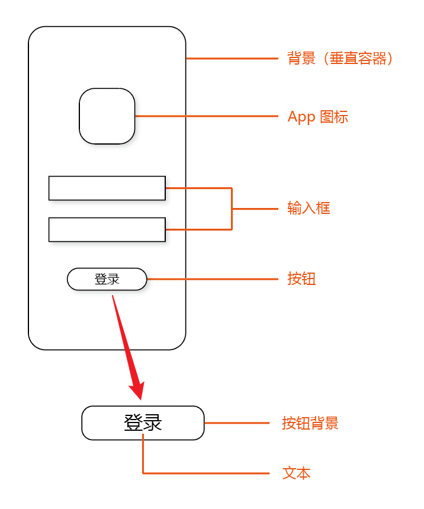
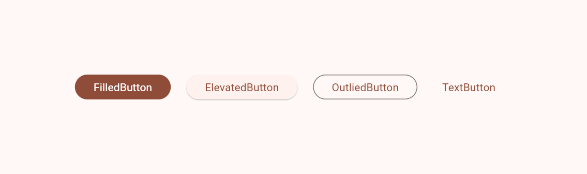

# 使用 Flutter 构建一个登录界面

## 目录

- [一、熟悉 Flutter 项目](#一熟悉-flutter-项目)
- [二、了解 UI](#二了解-ui)
- [三、解读 main.dart](#三解读-maindart)
- [四、编写代码](#四编写代码)
  - [（一）定义 App 类](#一定义-app-类)
  - [（二）定义 HomePage 类](#二定义-homepage-类)
  - [（三）简单摆放组件](#三简单摆放组件)
  - [（四）美化界面](#四美化界面)


## 一、熟悉 Flutter 项目

我已经新建了一个 [demo](../../demo) 项目，并且将全平台都勾选上了。
这里需要注意，你希望该项目能运行到哪些平台，就可以勾选对应的平台，全勾也行。

首先需要认识一下项目中这些文件夹的作用（一些无关紧要的已经忽略），平时我们只需要关注 **lib** 文件夹即可。

```
demo
├── android         平台代码: Android
├── ios             平台代码: iOS
├── lib             Dart 代码，这也是平时写代码的地方
├── linux           平台代码: Linux
├── macos           平台代码: macOS
├── test            测试代码（少用甚至不用）
├── web             平台代码: Web
├── windows         平台代码: Windows
├── pubspec.yaml    项目配置
```


## 二、了解 UI
构建界面，就如同搭积木一般，我们可以使用 Flutter 中已有的基础组件（积木）来构建我们的界面。

下图标注的区域都可以被称为一个组件，甚至整一个界面也可以叫一个组件。

我们所见到的形形色色的界面，都是由一个个组件，更准确地说，是由一个个小方块拼凑而成的。
这些方块有的具备圆角、阴影，可以显现出不一样的姿态。
更有甚者，我们见到的一片空白，也可能是一个单独的透明小方块。
我们可以指挥这些方块站在合适的位置，戴上合适的装饰，来组成我们想要的界面。

<p align="center">
    
</p>


## 三、解读 main.dart

打开 [lib/main.dart](../../demo/lib/main.dart)，你可以看到如下代码，在下方我已经尽可能详细得给出注释：

```dart
// void main 是程序入口点，运行 main.dart 会运行 main 函数里的内容
void main() {
  // 调用 runApp 运行 Flutter App
  // 传入的参数为 MyApp 对象（实质是 StatelessWidget）
  // 在 Dart 中创建类对象不需要使用 new 关键字
  // 使用 const 修饰符标记该对象不可变（性能优化），很多时候可以根据 Android Studio 的提示加上或去掉
  runApp(const MyApp());
}

// 定义 MyApp 继承自 StatelessWidget（无状态组件）
class MyApp extends StatelessWidget {
  // 这是声明 MyApp 的构造函数，在 {} 中可以定义命名参数，在调用时必须指定参数名
  // 这里是以父类（super）的 key 作为参数。在父类中已经声明了类型，Dart 可以推断类型，因此类型声明可以省略
  const MyApp({super.key});

  // @Override 表示重写
  // 这里需要重写父类的抽象方法 build 返回 Widget 对象构造页面内容
  @override
  Widget build(BuildContext context) {
    // MaterialApp 可以为我们提供 Material Design 的支持
    // 它继承自 StatefulWidget
    // 注：StatefulWidget 和 StatelessWidget 都继承自 Widget，因此它们都是 Widget
    return MaterialApp(
      // 设置该 App 在 Android 任务管理器显示的描述，在 iOS 中该值无效
      title: 'Flutter Demo',
      // 设置主题
      theme: ThemeData(
        // 配色方案，可以通过 ColorScheme.fromSeed 将一个颜色作为种子生成配色方案
        colorScheme: ColorScheme.fromSeed(seedColor: Colors.deepPurple),
        // 是否使用 Material Design 3
        // 我的 Flutter 版本是 3.24.1，此时 useMaterial3 的默认值为 true
        useMaterial3: true,
      ),
      // 设置首页
      home: const MyHomePage(title: 'Flutter Demo Home Page'),
    );
  }
}

// 定义 MyHomePage 继承自 StatefulWidget（有状态组件，就是其中有一些会跟随着用户操作而改变的组件状态值）
class MyHomePage extends StatefulWidget {
  // 这里还是一个构造函数
  // 这里 title 加了 required 表示该参数必须
  const MyHomePage({super.key, required this.title});
  
  // 这里定义了一个 String 类型的成员变量
  final String title;

  // 重写 StatefulWidget 的 createState 方法
  // 这里使用 => 来表示该函数返回 _MyHomePageState()
  // => 在函数的返回值为一个表达式时可以使用，让代码更简洁
  // 例：int getLength() => 2;
  @override
  State<MyHomePage> createState() => _MyHomePageState();
}

// 定义 MyHomePage 的状态，继承自 State<T>，T 继承自 StatefulWidget，表明该状态所属的组件
// 此处 MyHomePageState 前加了 _，表示该类在文件外部不可见
class _MyHomePageState extends State<MyHomePage> {
  // 这里也是同理不可见
  int _counter = 0;

  // 此方法用于让 _counter 加 1
  void _incrementCounter() {
    // 调用 setState让组件状态改变，如果直接让 _counter + 1 界面上不会更新 _counter 的值
    // 传入的参数是一个返回值为 void（无返回值）的函数
    setState(() {
      _counter++;
    });
  }

  // 和 StatelessWidget 类似，我们重写 State 的 build 方法，返回 Widget 对象
  @override
  Widget build(BuildContext context) {
    // Scaffold 是比较常用的用于构建页面的脚手架
    // 它提供了插槽用于放置页面内容、顶部导航栏和底部导航
    return Scaffold(
      // 顶部导航栏
      appBar: AppBar(
        // 顶部导航背景色
        // 使用 Theme.of(context).colorScheme 可以获取到我们当前的配色方案，配色方案中有颜色值可以选
        backgroundColor: Theme.of(context).colorScheme.inversePrimary,
        // 顶部导航文本，Text 也是一个 Widget，传入 String 类型参数可以显示文本
        title: Text(widget.title),
      ),
      // 页面内容
      // 使用 Center 可以让内容居中
      body: Center(
        // 给 child 传入放在 Center 中的内容
        // 使用 Column 可以让内容垂直摆放
        child: Column(
          // 调整子项在主轴（内容摆放的方向，此时为垂直方向）上居中
          mainAxisAlignment: MainAxisAlignment.center,
          // Column 的子项，Column 中可以有多个子项
          // 因此参数名为 children，传入的是 Widget 数组
          children: <Widget>[
            const Text(
              'You have pushed the button this many times:',
            ),
            Text(
              '$_counter',
              style: Theme.of(context).textTheme.headlineMedium,
            ),
          ],
        ),
      ),
      // 右小角悬浮按钮
      floatingActionButton: FloatingActionButton(
        // 按钮点击事件
        onPressed: _incrementCounter,
        // 长按该按钮的提示信息（在浏览器为鼠标悬停时）
        tooltip: 'Increment',
        // 按钮中的内容，此处为一个加号图标
        child: const Icon(Icons.add),
      ), // （翻译）尾部加个逗号会让自动同步（Ctrl + Alt + L）更好看
    );
  }
}
```


## 四、编写代码
我打算另起炉灶，新建一个 [login.dart](../../demo/lib/login.dart)。
你可以把 `main.dart` 中的文件清空，跟着我一起来。


### （一）定义 App 类
首先需要写一个 `App` 继承自 `StatelessWidget`，在 `build` 中返回 `MaterialApp`。
在 `main` 中调用 `runApp` 并传入 `App`。

```dart
import 'package:flutter/material.dart';

void main() => runApp(const App());

class App extends StatelessWidget {
  const App({super.key});

  @override
  Widget build(BuildContext context) {
    return MaterialApp();
  }
}
```

> **笔记**
> 
> 最前面的 `import ...` 部分是在写代码期间自动生成的，一般不需要我们手动写。
> 优化导入的快捷键是 `Ctrl` + `Alt` + `O`，可以快速格式化导入并将不必要的导入项去掉。

有一些内容需要讲一下，我们在写代码时，如果有错误、警告，可以将鼠标悬停在该地方，会弹出快速修复，点击即可修复代码（当然有时候修复会出现问题，如果不行就按 `Ctrl` + `Z` 撤回）。
修复的快捷操作是先将光标点到此处 `Alt` + `Enter`（回车），会弹出可选的修复项，一般选第一项，也就是直接回车。

在继承时，可以只写出继承，此时该类会被标记为红色，我们可以利用该修复快速生成重写模板。


我们再给 `MaterialApp` 传一些参数，例如 `title`、`colorScheme`。
前面提到了 `ThemeData` 的 `useMaterial3` 默认是开启的，所以就不用多此一举了。

```dart
import 'package:flutter/material.dart';

void main() => runApp(const App());

class App extends StatelessWidget {
  const App({super.key});

  @override
  Widget build(BuildContext context) {
    return MaterialApp(
      title: 'Login App',
      theme: ThemeData(
          colorScheme: ColorScheme.fromSeed(seedColor: Colors.deepOrange),
      ),
    );
  }
}
```

> **笔记**
>
> 在使用 `ColorScheme.fromSeed` 时需要传入类型为 `Color` 的 `seedColor`，你可以使用 `Colors`（注意有个 `s`）中的一些预设，也可以使用 `Color` 的构造传入十六进制数，或者使用 `Color.fromARGB` 传入 ARGB 值。
> ```dart
> void main() {
>   const Color(0xFF000000);
>   const Color.fromARGB(255, 200, 100, 100);
> }
> ```

### （二）定义 HomePage 类

接着刚刚写的内容，我们加一个 `HomePage` 和 `_HomePageState`。并且在 `MaterialApp` 中加上 `home` 为 `HomePage`

```dart
class App extends StatelessWidget {
  const App({super.key});

  @override
  Widget build(BuildContext context) {
    return MaterialApp(
      title: 'Login App',
      theme: ThemeData(
        colorScheme: ColorScheme.fromSeed(seedColor: Colors.deepOrange),
      ),
      home: const HomePage(),
    );
  }
}


class HomePage extends StatefulWidget {
  const HomePage({super.key});

  @override
  State<StatefulWidget> createState() => _HomePageState();
}

class _HomePageState extends State<HomePage> {
  @override
  Widget build(BuildContext context) {
    return Scaffold();
  }
}
```

### （三）简单摆放组件

现在需要向 `_HomePageState` 的 `build` 函数里的 `Scaffold` 中添加内容。照着先前的原型图，可以先简单地将页面搭建起来。


#### 1. 确定页面整体走向
首先我们注意到页面中内容基本上是垂直方向摆放的，这就意味着最外层我们需要使用 `Column` 来让整体内容垂直。

此外，在垂直方向上（也就是 `Column` 的主轴上），内容是居中的，因此需要为 `Column` 的 `mainAxisAlignment` 参数设置 `MainAxisAlignment.center`。
而水平方向默认是居中的，所以不用调。

这里的 `children` 参数是 `Column` 的子项，它是一个数组，你可以往这个数组中放其他组件。

```dart
class _HomePageState extends State<HomePage> {
  @override
  Widget build(BuildContext context) {
    return Scaffold(
      // 垂直排列
      body: Column(
        mainAxisAlignment: MainAxisAlignment.center,
        children: [],
      ),
    );
  }
}
```


#### 2. 添加 Logo
我们先到网上随便找一张图片，右键点击**复制图像链接**。


接着在 `children` 数组中添加一个 `Image.network` 的图片组件，它会加载网络链接的图片并显示。
这里将复制的链接作为第一个参数，接着调节一下宽高 `width` 和 `height`。

```dart
class _HomePageState extends State<HomePage> {
  @override
  Widget build(BuildContext context) {
    return Scaffold(
      // 垂直排列
      body: Column(
        mainAxisAlignment: MainAxisAlignment.center,
        children: [
          // Logo
          Image.network(
            "https://tse2-mm.cn.bing.net/th/id/OIP-C.SF_aG_oJS2nwzVeRKn7R9AAAAA?w=196&h=196&c=7&r=0&o=5&dpr=1.5&pid=1.7",
            width: 100,
            height: 100,
          ),
        ],
      ),
    );
  }
}
```


#### 3. 添加输入框
添加两个文本输入框 `TextField`，要注意这些组件是写在数组里的，要用逗号隔开。

```dart
class _HomePageState extends State<HomePage> {
  @override
  Widget build(BuildContext context) {
    return Scaffold(
      // 垂直排列
      body: Column(
        mainAxisAlignment: MainAxisAlignment.center,
        children: [
          // Logo
          Image.network(
            "https://tse2-mm.cn.bing.net/th/id/OIP-C.SF_aG_oJS2nwzVeRKn7R9AAAAA?w=196&h=196&c=7&r=0&o=5&dpr=1.5&pid=1.7",
            width: 100,
            height: 100,
          ),

          // 用户名输入框
          const TextField(),

          // 密码输入框
          const TextField(),
        ],
      ),
    );
  }
}
```


#### 4. 添加按钮
最后要添加一个按钮，按钮的种类有很多，`FilledButton`、`ElevatedButton`、`OutliedButton`、`TextButton` 等等，基本上只需要改一下类名，参数都差不多，可以根据自己的喜好。

按钮的 `onPressed` 参数类型是函数，可以使用匿名函数传一个空的。

`child` 是按钮中的内容，理论上你可以放任何组件，一般我们放一个文本 `Text`。




```dart
class _HomePageState extends State<HomePage> {
  @override
  Widget build(BuildContext context) {
    return Scaffold(
      // 垂直排列
      body: Column(
        mainAxisAlignment: MainAxisAlignment.center,
        children: [
          // Logo
          Image.network(
            "https://tse2-mm.cn.bing.net/th/id/OIP-C.SF_aG_oJS2nwzVeRKn7R9AAAAA?w=196&h=196&c=7&r=0&o=5&dpr=1.5&pid=1.7",
            width: 100,
            height: 100,
          ),

          // 用户名输入框
          const TextField(),

          // 密码输入框
          const TextField(),

          // 登录按钮
          ElevatedButton(
            onPressed: () {},
            child: const Text('登录'),
          ),
        ],
      ),
    );
  }
}
```


### （四）美化界面
经过上面的步骤后，你的界面大致是这样的：


我们需要调一下各个组件的边距，让它们看起来不那么挤。

这里我加入了 `SizedBox`，并且设置了 `height` 的值。
因为 `SizedBox` 本身并没有什么内容，也没有颜色，它只会占据一部分空间，从而让两个组件间隔变大。

另外，我在 `TextField` 外层包裹了一层 `Padding`，并且将 `EdgeInsets.symmetric` 作为 `padding` 的值，此时 `TextField` 左右空出 `50`，上下空出 `25`。

```dart
class _HomePageState extends State<HomePage> {
  @override
  Widget build(BuildContext context) {
    return Scaffold(
      // 垂直排列
      body: Column(
        mainAxisAlignment: MainAxisAlignment.center,
        children: [
          // Logo
          Image.network(
            "https://tse2-mm.cn.bing.net/th/id/OIP-C.SF_aG_oJS2nwzVeRKn7R9AAAAA?w=196&h=196&c=7&r=0&o=5&dpr=1.5&pid=1.7",
            width: 100,
            height: 100,
          ),
          
          const SizedBox(height: 80,),

          // 用户名输入框
          const Padding(
            padding: EdgeInsets.symmetric(horizontal: 50, vertical: 25),
            child: TextField(),
          ),

          // 密码输入框
          const Padding(
            padding: EdgeInsets.symmetric(horizontal: 50, vertical: 25),
            child: TextField(),
          ),

          const SizedBox(height: 40,),

          // 登录按钮
          ElevatedButton(
            onPressed: () {},
            child: const Text('登录'),
          ),
        ],
      ),
    );
  }
}
```

最后，使用 `decoration` 给 `TextField` 加点提示文字，大功告成。

```dart
class _HomePageState extends State<HomePage> {
  @override
  Widget build(BuildContext context) {
    return Scaffold(
      // 垂直排列
      body: Column(
        mainAxisAlignment: MainAxisAlignment.center,
        children: [
          // Logo
          Image.network(
            "https://tse2-mm.cn.bing.net/th/id/OIP-C.SF_aG_oJS2nwzVeRKn7R9AAAAA?w=196&h=196&c=7&r=0&o=5&dpr=1.5&pid=1.7",
            width: 100,
            height: 100,
          ),

          const SizedBox(height: 80,),

          // 用户名输入框
          const Padding(
            padding: EdgeInsets.symmetric(horizontal: 50, vertical: 25),
            child: TextField(
              decoration: InputDecoration(
                label: Text('账号'),
              ),
            ),
          ),

          // 密码输入框
          const Padding(
            padding: EdgeInsets.symmetric(horizontal: 50, vertical: 25),
            child: TextField(
              decoration: InputDecoration(
                label: Text('密码'),
              ),
            ),
          ),

          const SizedBox(height: 40,),

          // 登录按钮
          ElevatedButton(
            onPressed: () {},
            child: const Text('登录'),
          ),
        ],
      ),
    );
  }
}
```

