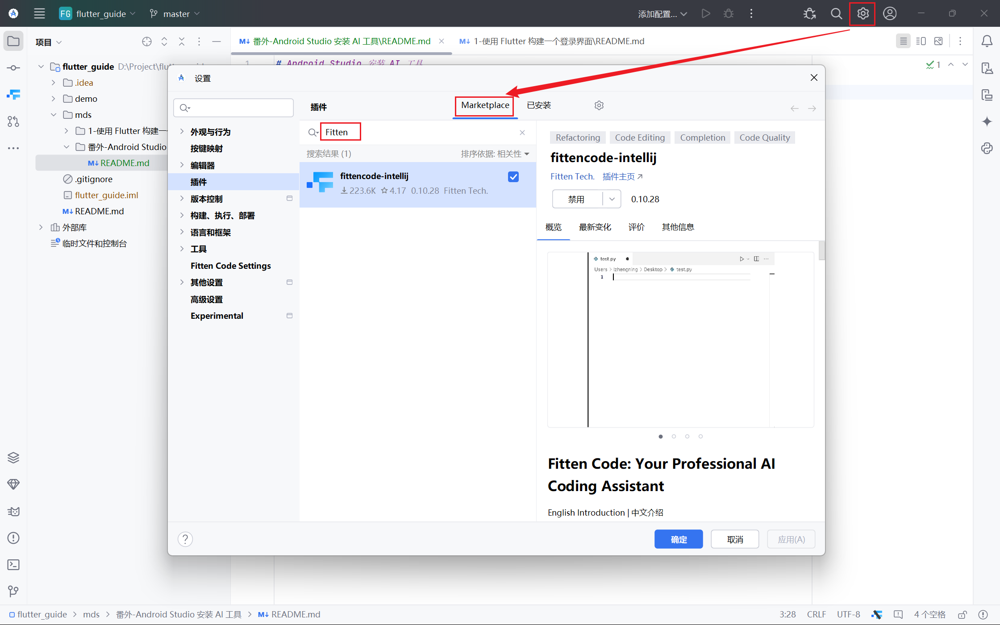
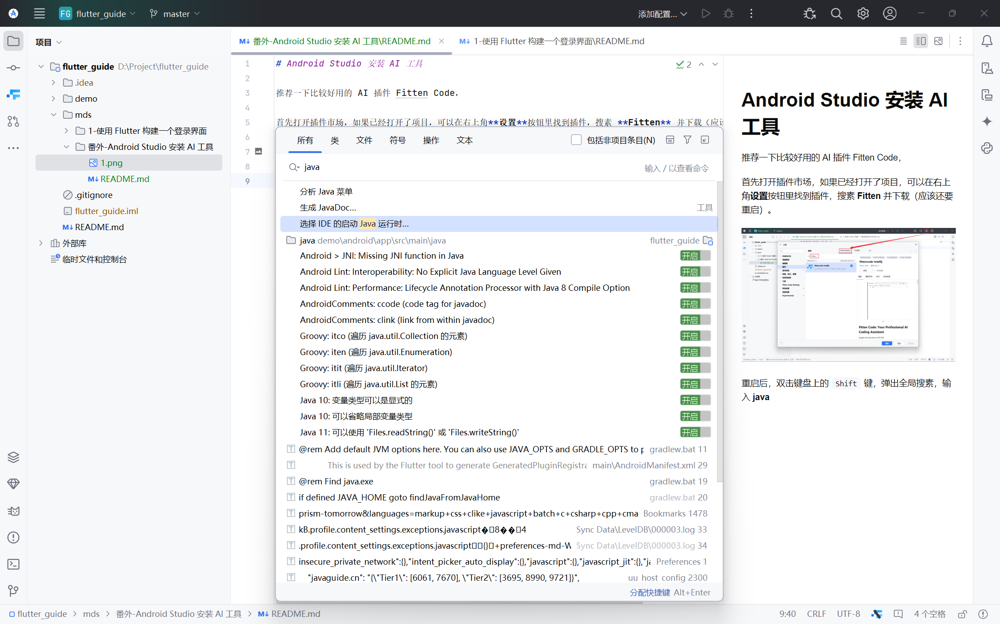
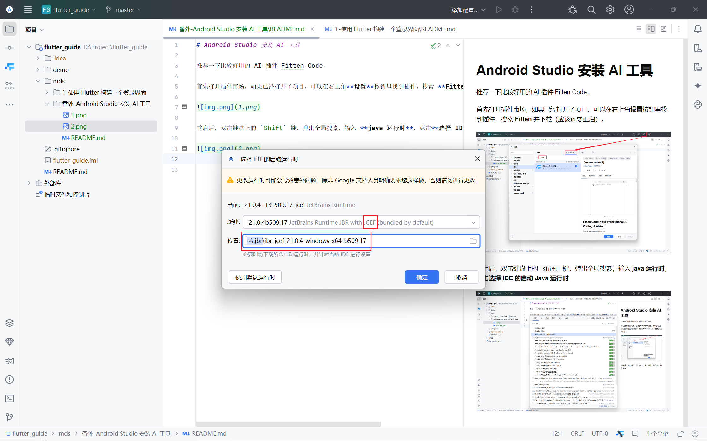
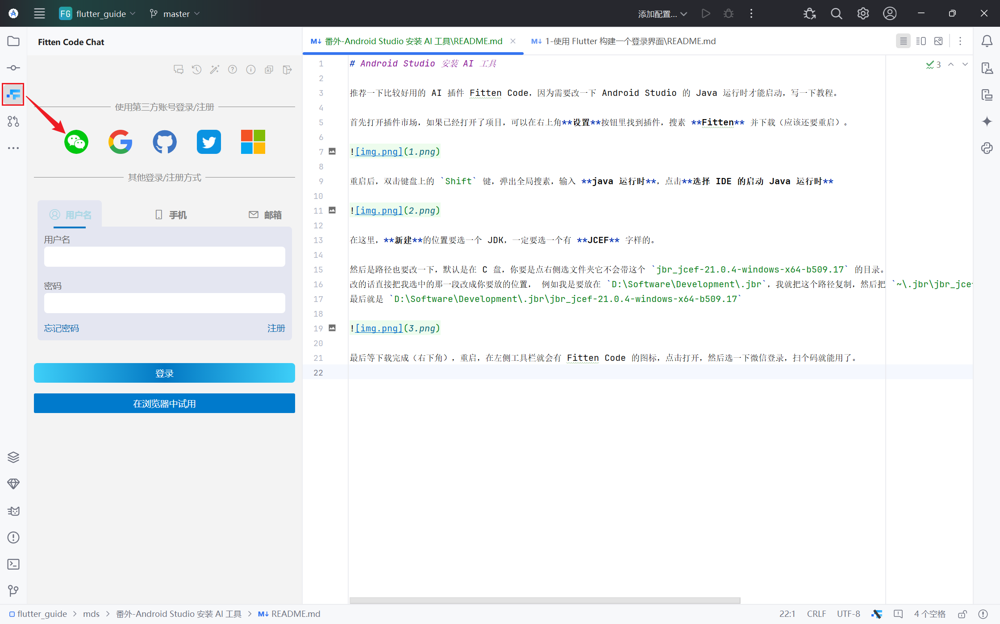
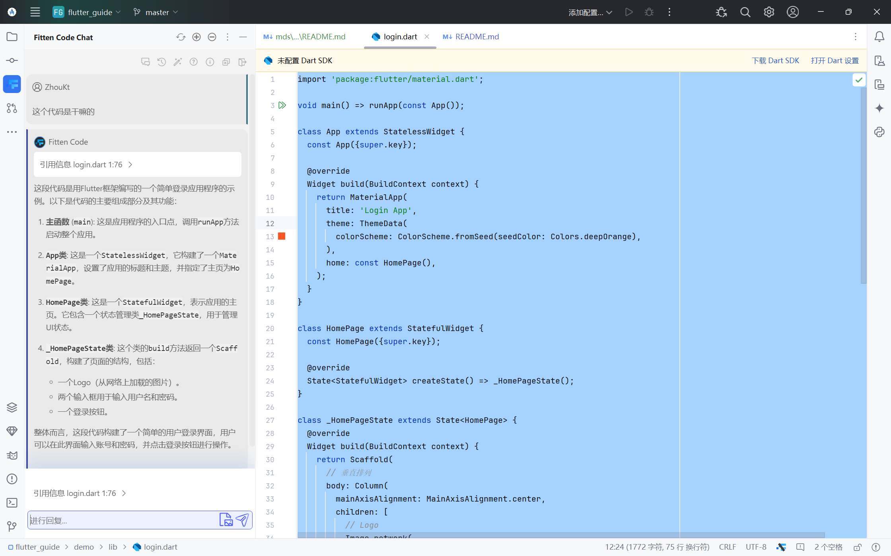

# Android Studio 安装 AI 工具

推荐一下比较好用的 AI 插件 Fitten Code，因为需要改一下 Android Studio 的 Java 运行时才能启动，写一下教程。

首先打开插件市场，如果已经打开了项目，可以在右上角**设置**按钮里找到插件，搜素 **Fitten** 并下载（应该还要重启）。

重启后，双击键盘上的 `Shift` 键，弹出全局搜素，输入 **java 运行时**，点击**选择 IDE 的启动 Java 运行时**

在这里，**新建**的位置要选一个 JDK，一定要选一个有 **JCEF** 字样的。

然后是路径也要改一下，默认是在 C 盘，你要是点右侧选文件夹它不会带这个 `jbr_jcef-21.0.4-windows-x64-b509.17` 的目录。

改的话直接把下图我选中的那一段改成你要放的位置， 例如我是要放在 `D:\Software\Development\.jbr`，我就把这个路径复制，然后把 `~\.jbr\jbr_jcef-21.0.4-windows-x64-b509.17` 的前半段 `~\.jbr` 直接换成我的路径。

最后就是 `D:\Software\Development\.jbr\jbr_jcef-21.0.4-windows-x64-b509.17`

最后等下载完成（右下角），重启，在左侧工具栏就会有 Fitten Code 的图标，点击打开，然后选一下微信登录，扫个码就能用了。

平时使用可以直接在输入框输入。

如果是代码里有问题，可以直接选中代码，然后点一下输入框，就会显示**引用信息**，这时候发送文字消息，会将选中的代码也一起发出去。

